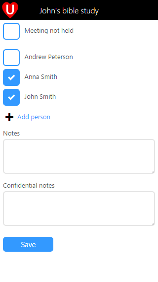
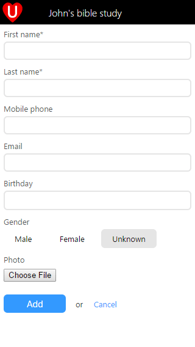
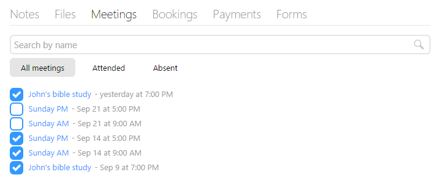

Following up from our meeting updates earlier this month we've continued to refine meetings and attendance reporting in UCare. The attendance report now includes an **Add person** button, tap this and you can enter the person's details and record them as having attended the meeting. When using this form you are often not signed into UCare, even though if the details of the person you add matches an existing UCare profile then instead of creating a new person the existing person will be recorded as having attended the meeting. In this way small group leaders can record when new people attended without you having to give the small group leader that person's contact info and potentially breach their privacy.

This quick add new person button is also now available on Group, Meeting and Process pages so that you can quickly added new people without having to jump out of your current workflow.

   

The list of names that are displayed on attendance report and meeting pages has also been updated to include people who have recently attended a meeting of that group. So if a small group leader adds a new person their name will be in the list the next time the leader records attendance for the small group. To further reduce the amount of manual work your team needs to do UCare will now automatically add a visitor as a group member once they attend at least three of the meetings displayed on the group's page.

The final meeting related changes we made is on the person's profile page, the meetings tab now displays all the meetings for groups that person is a member of; even if they didn't attend. These meetings can be filtered to **All meetings**, only those they **Attended** or the meetings they were **Absent** from. Additionally you can either check or uncheck their attendance right from this tab rather than having to open a meeting as you had to previously.

With these and other updates we’re working hard to make UCare smarter and easier to use, if you have any feedback we’d love to hear from you, simply email support@ucarehq.com.