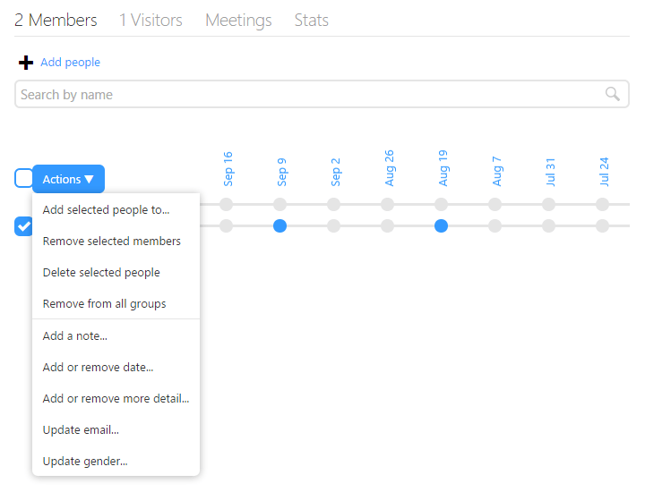
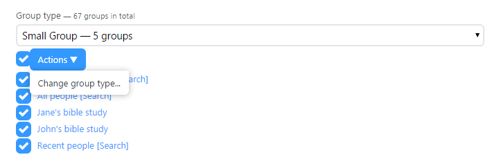

We recently updated the group, household and people list pages to add a number of bulk actions. This will be of particular use if you have a number of people that you want to perform the same action on.

As you hover over each person on these pages a check box appears to the left of their name. Once you’ve selected all the people you want to perform a bulk action on click the action menu and pick one of the following options:

 

*   **Add selected people to...**: Add the selected people to another group, meeting or process.
*   **Remove selected members**: Remove the selected members from the group (only available under members on the group page).
*   **Add selected people as members**: Add the selected visitors to the group (only available under visitors on the group page).
*   **Delete selected people**: Delete all the selected people.
*   **Remove from all groups**: Remove the selected people from all groups.
*   **Add a note...**: Add a note to all the selected people.
*   **Add or remove date....**: Add or remove a date to the selected people.
*   **Add or remove more detail...**: Add or remove a more detail field to the selected people.
*   **Update email...**: Reset a failed email address, or subscribe/unsubscribe the selected people from email.
*   **Update gender...**: Update the gender of the selected people.

  
We’ve also added a bulk change type action to the group list, form list and process list pages. As with people select each item that you want to perform the action on and then click the action menu. Finally enter the new type and click change type.

  
With these and other updates we’re working hard to make UCare smarter and easier to use, if you have any feedback we’d love to hear from you, simply email support@ucarehq.com.