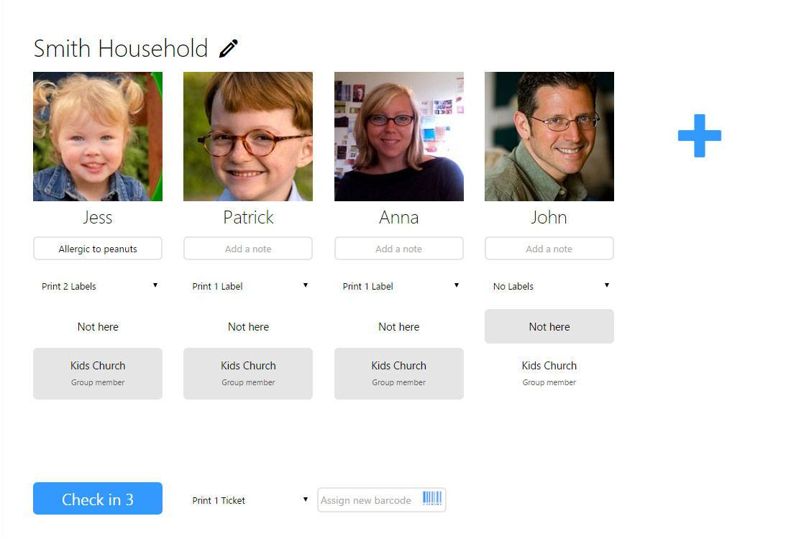

With the design of the Check in Kiosk we aim to make it super easy to use, even if you have multiple location, rooms and age groups we design the Kiosk to make it all possible and without losing the simplicity.

We kept that goal in mind while adding some recent updates to the kiosk. Some churches have their children’s areas in different parts of the church and so both parents needed a security ticket, other churches wanted a way label bags or other items that came with a child. We’ve made both these options available when using maned check in mode, simply select how many labels and tickets you want from the drop down.

We’ve also made a few other changes to the Kiosk that we think you’ll appreciate:

1.  1\. When searching for a household in the kiosk, if they are the only household that matches then we’ll load them right away.
2.  2\. If any family member has a meeting that says they are a “Group member” we’ll select that meeting automatically, so now you may just need to click the **Check in** button.
3.  3\. The Kiosk will now save notes that you enter so that you don’t have to retype notes each time or go to each person’s profile to save the notes.
4.  4\. The Finish button now tells you how many people you're checking in or out, and if you haven't selected anyone it'll just say **← Back**.

#### Much more :)

That’s not the only updates we’ve made mind you, here are some more changes we’ve made recently:

1.  1\. The notes report can now report by who created the note so that you can get a report for each pastoral care person and you can choose if you only want notes from a paticular security area, e.g. just show "Protected" notes.
2.  2\. Search groups now have a number of new options. Search for people depending on if they are or aren’t in any process, a particular process, or a step of a process. You can also now find all the people who have a particular date that was last month, this month or next month. For example you could find all the wedding anniversaries coming up next month instead of in the next 30 days that was your option previously.
3.  3\. You can now import groups, this works similar to importing people but instead of importing a list of people it lets you import a list of groups. For example you could import all your small groups.
4.  4\. There are a ton of new batch update options for processes, email messages, events, meetings, forms and groups. Things like batch delete, changing owners, types, meeting times and more.
5.  5\. You can now re-order the steps of a process.
6.  6\. Any stats that you record for a meeting now display on the Group View Stats report. For example if you record a giving Stat for each meeting then the report will tell you what your total, min, max and average giving per person was for each month listed on the report.

With these and other updates we’re working hard to make UCare smarter and easier to use, if you have any feedback we’d love to hear from you, simply email support@ucarehq.com.