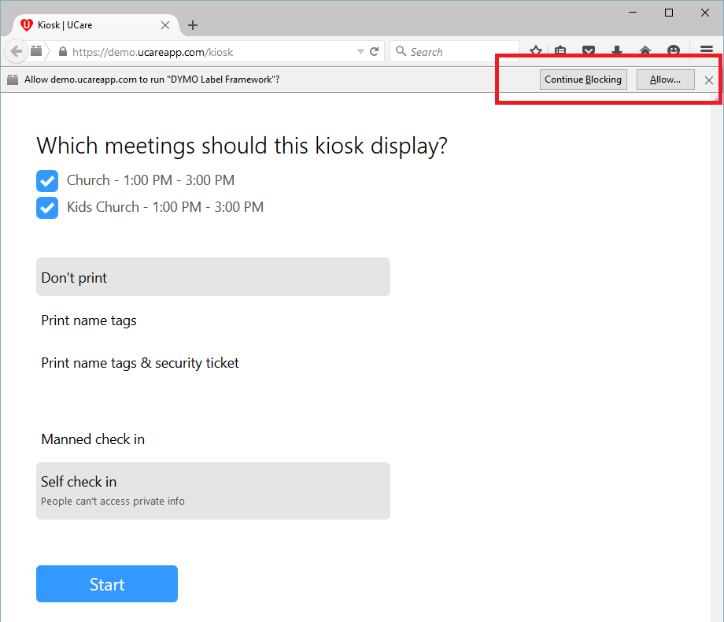

This week Google released a new version of their Chrome web browser (version 45 to be specific). With this release they have dropped support for a key feature required to be able to use the DYMO printers for printing.

Microsoft also recently released Windows 10 that comes with a new web browser, Microsoft Edge. This browser is also missing the feature previously supported in Internet Explorer that enables DYMO printing.

The DYMO team are in the final stages of testing and rolling out new printing support for Chrome and Edge that will fix the printing issues. Unfortunately this update won’t be ready until early 2016 on Windows and OSX.

In the meantime while DYMO are getting this resolved it's recommended that on Windows you switch to use Firefox or Internet Explorer 10/11. On Mac OSX it's recommended you switch to use Firefox or Safari. Safari is preinstalled on OSX and Internet Explorer is preinstalled on Windows (even Windows 10), but testing has shown better results with Firefox, [download it here](https://www.mozilla.org/en-US/firefox/new/).

The first time the UCare kiosk is opened in Firefox it will ask if UCare can print to the DYMO printer. Click the Allow button as shown below and then refresh the page, the attached printers will now be available from the printer drop down. Next simply tap the start button and you’ll be able to use the kiosk as normal.

If you have any question regarding this please contact support@ucarehq.com