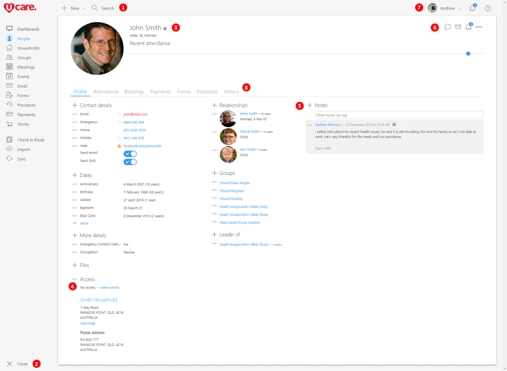
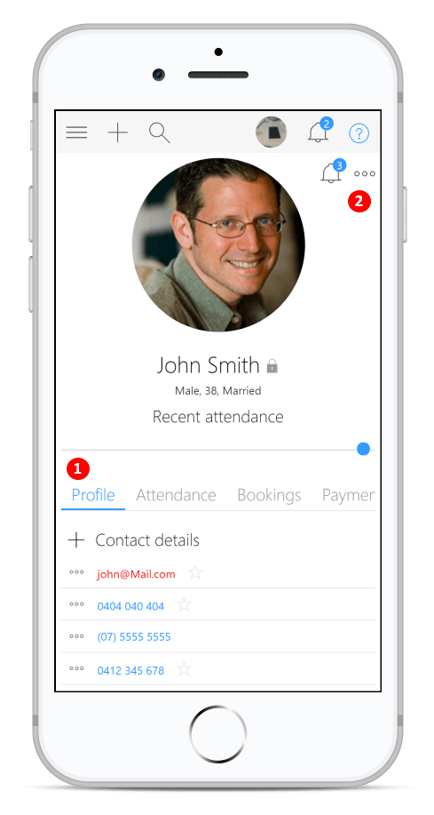

When you signed in to UCare today you would have been presented with our new design. Our design team have been working on this new design for a while. The intent has been to tighten up the layout so that it makes more efficient use of screen space. We are also aligning the colors and icons with our new branding which gives UCare a much brighter and more modern look that improves contrast for better readability. While most functionality is still located in a similar place we wanted to highlight the few main layout changes.

Before we look at those changes though we need to stop and talk about Internet Explorer. We continue to support Internet Explorer 11 as we have in the past, but we wanted to let you know there are better options now available. In our testing of this new design one thing that has really stood out is just how much faster a modern browser is, and at almost five years old Internet Explorer is no longer considered modern or fast.

The browsers that we regularly test with are Chrome, Firefox, Safari and Edge, they are all great choices that we highly recommend. We also want to let you know that the number of Internet Explorer users is continuing to decline and we plan to phase out support of for Internet Explorer by the start of 2019. With that and so many great new options, now is a great time to look at moving to one of these modern browsers.

1.  The New menu has moved up next to search, in user testing we often observed users getting confused by the new menu popping open when not expected. As such it now will only open if you click on it, not when you hover over it. And by moving it's position slightly it also reduces the risk of confusion that happened because the old New menu opened in the same position as the nav menu.
    
    When you click on Search it shows the 10 most recent items that you’ve viewed as always, but we’ve added a heading so that new users better understand why they are seeing those items.
    
2.  The nav menu button used to be at the top left and was used for expanding or collapsing the nav menu, again in observing users we saw that the menu button was used infrequently so it was moved to the bottom. Previously if the nav menu was “closed”, then when you moved your mouse over it, the whole nav menu would pop open. This was often not want people wanted, so now you have to click the menu button down the bottom to open or close the nav menu.
    
3.  UCare has the ability to restrict access to almost any piece of info, we’ve added a new “lock” icon to indicate that a piece of info is restricted. If you move your mouse over the top you’ll see which security areas have access to that info.
    
    You’ll also now see at the top of every page a title, this is to help people that have the nav menu closed so that they can better see where they currently are in UCare. Images now also display in the top left of the page, not the top right as previously, by placing the image near the title we help connect the two and improve comprehension.
    
4.  Granting access to UCare hasn’t really changed, but the options to grant access have moved under this little option menu next to the Access heading. These options menu icons are located all through UCare, basically anywhere there are more options for you to use.
    
5.  To take better advantage of large screens we’ve added a couple of three column layouts. You can see in this picture that the Notes section is displayed on the right. If the screen is smaller, then the notes will wrap down under the first two columns, and if you’re using a phone or small tablet then everything will be in one column.
    
6.  In the old design commands that were related to the current page were displayed in a column to the right of the page. This used up a lot of screen space for people that were using smaller screens or for people that had a lot of info to display on the screen (e.g. attendance or reports).
    
    All those commands have been converted into a toolbar that sits in the top right of the page. The most common commands display in the toolbar, while less commonly used commands display under the … options menu. When you hover over one of the toolbar buttons you’ll see a tooltip indicating exactly what it is, and when you click on the options menu you’ll see the name of each of the other available commands.
    
    The biggest change for most users we’ve tested with has been that the “Edit” and “Delete” buttons are now located under the … options menu. So if you want to edit or delete the item you are currently viewing then you’ll now find those options located in the top right under the … .
    
    You’ll also note that Tasks are now displayed here as a little Bell icon. If there are any tasks related to the page you are viewing then a number will display to indicate how many, and it will be red if the tasks are overdue. You can click on that icon to see those tasks or to add more tasks. Note that this icon is not quite the same as the Bell icon displayed above it.
    
7.  The Bell (notification) icon displayed in the very top indicates how many tasks are currently assigned to you. You can click it to view all your current tasks, or the tasks you’ve assigned to others. Again, if there are any overdue tasks the number will be red.
    
    Note that the current user now has there Photo and Name displayed in the top header to make it easier to see who is currently signed in. If you click the photo or name you’ll get three options. 1. The profile of the current user. 2. Access to UCare settings. Or 3. The Sign out option that you should use each time you have finished using UCare. This will ensure others can’t just jump into UCare and access info that they shouldn’t.
    
8.  The latest activity command that used to be listed on the right side of each page now has it's own tab (depending on your access level you may not see it). Tapping on the history tab will show you who's been viewing or changing any info related to that page you are looking at.
    

While most of the changes are similar in the mobile website and the UCare app there are a couple of extra things to note.

1.  If there are more Tabs then can fit on screen then the tabs now scroll left and right, simply tap and drag on the tabs to move left or right, revealing other tabs.
    
2.  In the old design some content was moved on to a right hand side menu, this was problematic for many users as the design was not common and the users never saw the info displayed there. All of that information is now displayed either further down the page or if it was a command it is displayed under the … options menu.
    
    Also, the toolbar that is displayed in the top right on larger screens, gets compressed under the … options menu on smaller screens, for example on smart phones or small tablets.
    

Please note that images and videos in our help center still have the old design, the layout is similar but not the same so we’ll be updating those help articles over the coming weeks.

With these changes we’re working hard to make UCare easier to use, if you have any feedback we’d love to hear from you, simply tap the green help button and send your message.