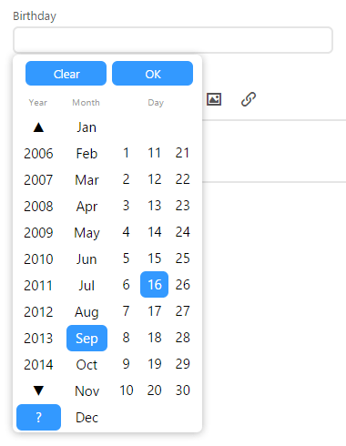
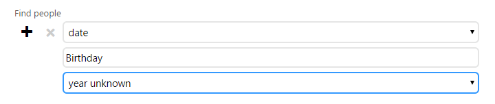

Every now and then do you need to enter a date but don’t know the year, maybe it’s someone’s birthday or it’s just an anniversary date for renewing a qualification. 

Previously you’d have to enter 1900 or some other fixed number as the year for date with an unknown year. To make things easier we’ve added an unknown year option to the date picker, so now if you don’t know the year simply select “?” as the year.

We didn’t stop there though, we also added a new option to search groups. In the following example you can see that you can now find dates where the year is unknown. In this example we’re looking for people who haven’t given their year of birth.

We also made a minor change to the way people are sorted, now instead of the sort order being last name, first name we now sort people by last name, household, first name. This is intended to make things a little easier when you have multiple households that have the same last name.  
  

With these and other updates we’re working hard to make UCare smarter and easier to use, if you have any feedback we’d love to hear from you, simply email support@ucarehq.com.