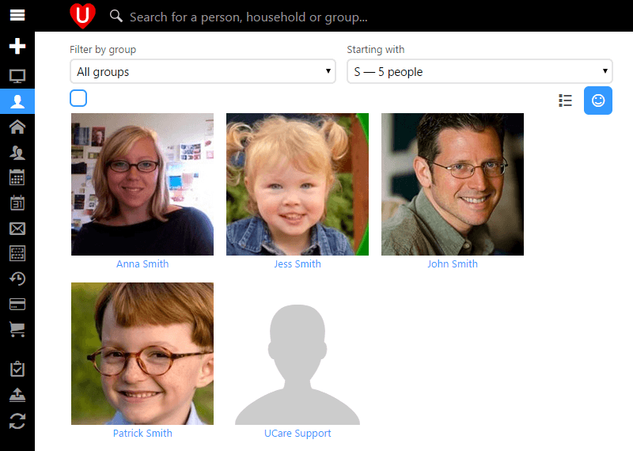

We've been working on making UCare feel even more personal than before and have introduced a new Face view on the people page. In the top right of the page you can select either **List View** like we've always had or **Face View** which will show a photo for everyone. You'll also see that you can now filter the people by group, so if you want to see the faces of your children then filter by the children's group, select **All** from the Starting with field and ensure the Face View option is selected. Below is an example for a small church where they want to see everyone whose last name starts with S.

One thing that you may find useful with this new view is getting to know the people in your church and as a team going through each person to chat through what their personal needs are and how you can help serve them better as a church. It's a really simple way to make care more personal and make people feel more a part of the family.

#### Event check-in

Each event now includes an event check-in page, when viewing an event it is in the list of commands on the right. When you open it you'll be able to quickly look up bookings or scan tickets using the camera on the device and then check people into your event. This helps you ensure that only people that have paid for tickets are attending so not to be taking the seats of people that have paid. It also helps you keep track of exactly who attended so that you can easily contact them after the event.

#### Digital products

In the past when uploading media to UCare it would start the upload but not offer much feedback on the progress of the upload, people found this confusing and sometimes would accidentally cancel an upload meaning they had to start again. So we've added a new upload indicator and now you can see exactly which files are uploading, how much is left and how long it will take.

On top of that if your church is one of the many using Stores, then you can now assign barcodes to your products so that the purchase process at your church resource centre is much faster and easier than before. Simply scan the product and it's ready to be added to the order.

With these and other updates we’re working hard to make UCare smarter and easier to use, if you have any feedback we’d love to hear from you, simply email support@ucarehq.com.