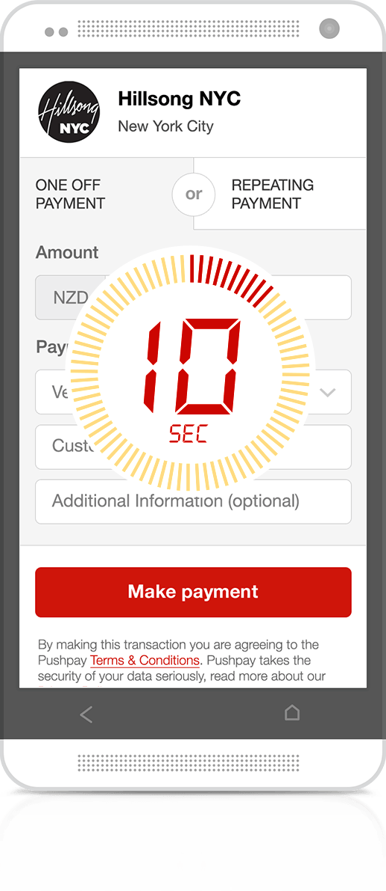

Would you like to provide your church attenders and visitors with opportunities to be more generous, so that your church has the financial resources to more effectively be the Church in the world? Which church leader wouldn’t this and yet research shows that only about 20% of people give regularly to the church they attend.

What we’ve found is that people want to give and when giving becomes easier, generosity increases. These days’ cash and checks are used less often or not carried, other giving methods tend to be cumbersome and time consuming. To help fix this we’ve partnered with the team at Pushpay who create a fast, easy giving solution. They allow people to make secure 10 second payments from their iOS or Android smart device, or they can give via text (i.e. SMS), kiosk or online.

These options also reduce the amount of time that you need to spend on giving in your services to the point that you might even consider not passing collection buckets but just leaving them at the information desk.

We love that Pushpay is helping not only engage new givers, but also transitioning them into engaged and recurring givers. ExperienceChurch.tv in Puyallup, WA, USA rolled out the Pushpay app with UCare and has seen an astounding 1,000% increase in mobile giving.

In a recent interview at [ChurchExecutive.com](http://churchexecutive.com/archives/creating-a-culture-of-generosity-7), Senior Pastor Dennis Cummins said “With the integration of Pushpay into UCare, it has only taken a few months and we’re light years ahead of where we were.”. Cummins followed up with “I look at the numbers, and it just blows me away,” “It creates consistent cash flow, which is so critical in churches.”

Pushpay also interview Pastor Cummins in the following video:  
<iframe style="max-width: 100%;" src="https://www.youtube-nocookie.com/embed/rIyzL8-ppcI?rel=0&amp;showinfo=0" width="620" height="349" frameborder="0" allowfullscreen=""></iframe>

### Your benefactor’s security is paramount

 Pushpay invests in regular independent testing of their bank grade ([PCI compliant](https://en.wikipedia.org/wiki/Payment_Card_Industry_Data_Security_Standard)) payments infrastructure. Likewise, UCare also invests in this level of testing and compliance. This means bank and credit card details are stored securely in order to prevent unauthorized access. And even if people lose their phone, payments cannot be made without a secure 4-digit passcode.

### How do you get started?

If you aren’t currently using Pushpay, [get a quick demo of thier giving solution](https://info.echurchgiving.com/lp-demo-awkward-giving-conversation.html?utm_medium=partner&utm_source=ucare&utm_content=content-demo-request&utm_campaign=demo-awkward-giving-conversation&utm_term=faith--all--all) and see if it is a good fit for your church.

Once you are a Pushpay customer, ask a Super admin to go to the Payment settings in UCare. They need to select Pushpay as the payment service and then click the connect button. Pushpay will ask to confirm granting access at which point UCare will start importing payments from Pushpay. UCare even matches payments with people’s existing profiles to help avoid duplicate profiles.

Upon connection; credit card payments from UCare will also be processed by Pushpay and deposited in your bank account. This includes event registrations payments and store purchases, centralizing payments and reducing the administration burden.

We’ve also recently added a new payments options so you can email payment statements to your benefactor, this will be an important for tax purposes. See our [payment settings](https://ucare.zendesk.com/hc/en-us/articles/201955464-Changing-payment-settings) and [payment statements](https://ucare.zendesk.com/hc/en-us/articles/202205070-Email-payment-statements) help articles for more info.

Pushpay is currently available in the United states, Australia, Canada and New Zealand. If you’re interested in finding out more we’d love to hear from you, simply email support@ucarehq.com.