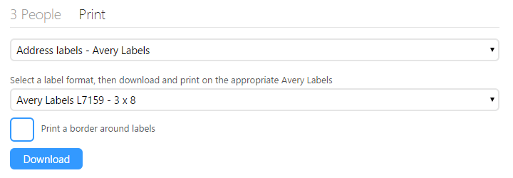

Avery labels have been commonly used for creating labels for many years, hence why we've just released some new print options to support them. Previously the print options were on the right side of the Group and Meeting pages and would take you to separate printing pages. In order to provide enough space for the new printing options and to keep them in context we moved them to their own tab called Print. Here you can select to print mailing labels, name tag labels or preprint check in labels and security tickets, either directly to a DYMO LabelWriter or to PDF that can be printed on Avery labels.

One interesting option the new print options open up is when running events, by printing **Name tag labels - Avery Labels** with the **Avery 2 x 5 or 2 x 4** size you can create names tags that are perfectly sized for lanyards. These name tags include a bar code that can be used to quickly look up the person in UCare when making a purchase or re-registering for your next event. If you set up self-serve stations then people can even scan their own lanyard when re-registering for your next event or purchasing digital products, such as session recording or music.

With these and other updates we’re working hard to make UCare smarter and easier to use, if you have any feedback we’d love to hear from you, simply email support@ucarehq.com.