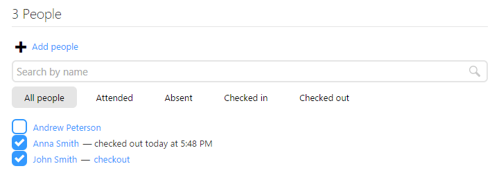
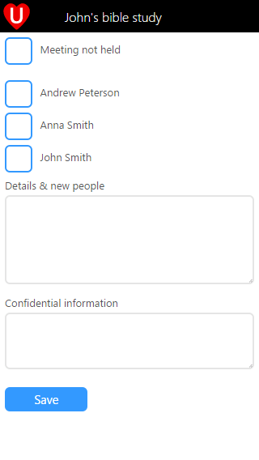

We recently made some changes to how the meetings page in UCare works, but rest assured we always make these kinds of changes with good reason. Our research showed that the meeting page was confusing for people that were getting started with UCare, whereas the meeting report page was instantly understandable.

So what was the big difference? The report was a simple check list while the meeting page had a list of the people in attendance and a list of absent people. The absent list had a plus button next to each person that you clicked to record a person as having attended. Our research showed that this wasn’t obvious to many first time users.

What have we changed you ask? First we merged the attended/absent tabs into one, and now you simply check a person of to record that they have attended. And how do you check them out? You don’t uncheck them (which indicates they didn’t attend) instead like previous, you simply click checkout.

We realised that the absent and attended tabs were useful, and so you didn’t lose this we also added a filter option of “All people”, Attended and Absent that will filter the list. We also added two new options here, “Checked in” and “Checked out”. Checked out is actually very handy when parents are picking up their kids. As you click check out the child is filtered from the list so that the list gets shorter and quicker to find the next child.

In addition to these changes we’ve added a new “Meeting not held” option to the attendance report. Now if your meeting happens to not be run for some reason you can check this to record that information.

With these and other updates we’re working hard to make UCare smarter and easier to use, if you have any feedback we’d love to hear from you. Please contact us at support@ucarehq.com.