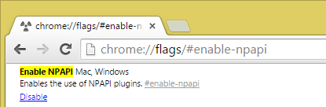

This is a follow up to the article posted on January 23 and relates to our Google Chrome users only.

In the last week Google has released a new version of Chrome (version 42 to be specific) that has completely disabled some DYMO printers. You can manually re-enable the DYMO printers by typing the following into the Chrome address bar and enabling the setting: **chrome://flags/#enable-npapi**

It has been our experience that after enabling this setting you need to restart Google Chrome and in some instances you may need to restart your computer.

[Test to see if you](http://labelwriter.com/software/dls/sdk/samples/js/CheckEnvironment/CheckEnvironment.html) have the DYMO printer installed and enabled correctly.