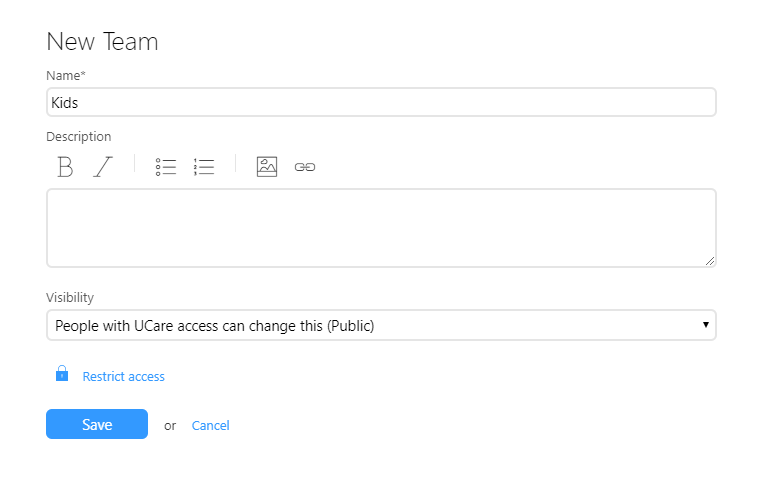
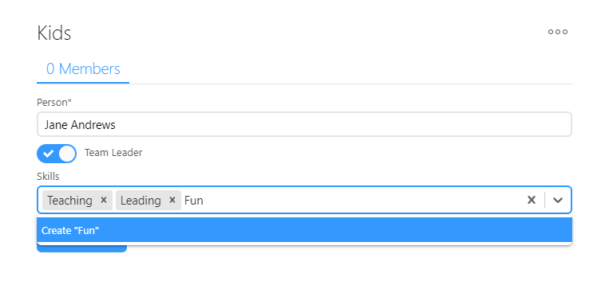
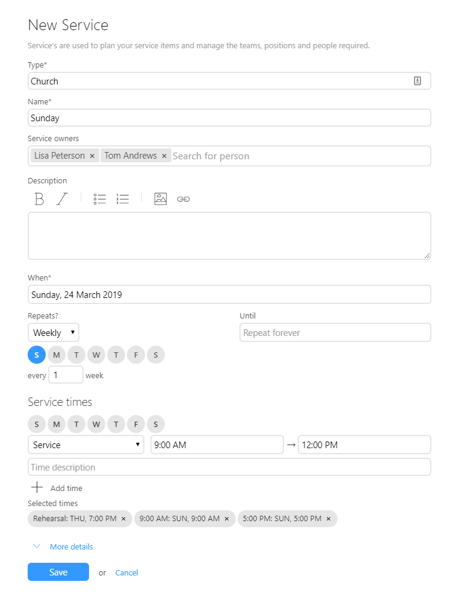
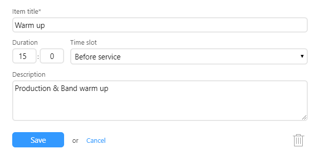
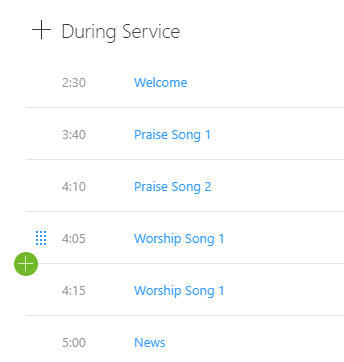
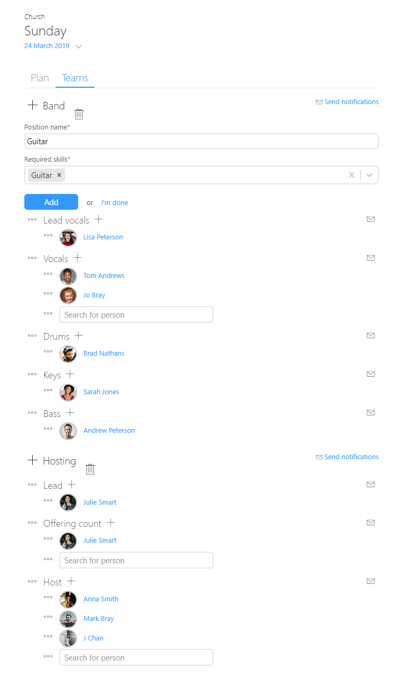
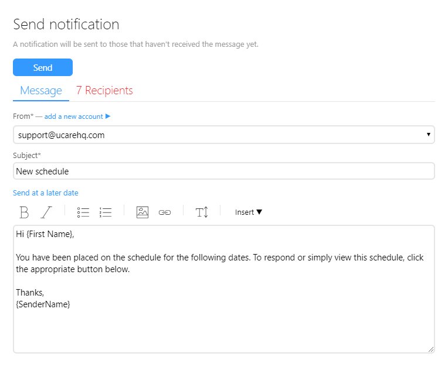
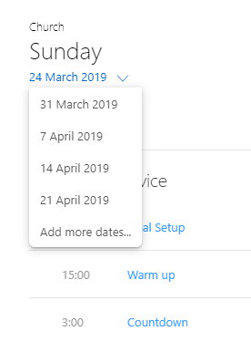
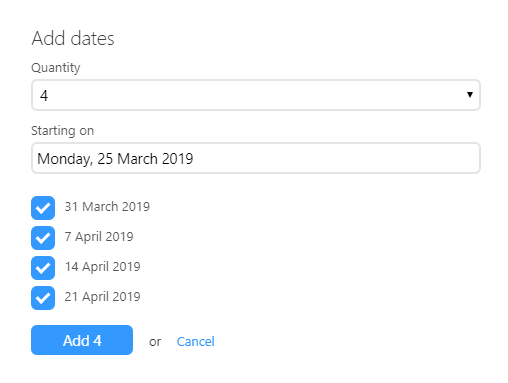

We’re excited to announce that after more than two years of work the initial release of Services and Teams are live in UCare.

Services and Teams have been designed so you can better organize your services and team by scheduling (i.e. roster) people and planning your order of service and run time.

Modern church life can have many moving parts involving many teams and people so we want to simplify keeping track of service requirements and the availability of your teams. There’s now a way to track when people are unavailable (e.g. away on holidays), plus which teams they can (or can’t serve on) and what skills they have so that team leaders can quickly find people to fill positions.

UCare will take care of notifying people and reminding them of different times they’re required. If something happens and they can’t make it (e.g. a sick child) then we’ve made it as easy as replying to a notification email to let appropriate leaders know so they can find a replacement.

We know for experience talking to churches that people already have too many passwords and how easy it is to forget them, they become a barrier that stops people from responding to notifications and submitting unavailability. As such we’ve designed Services and Teams so that volunteers can interact with these features without needing a password. This is just like how small group reports already work in UCare.

### Why teams, why not groups?

As part of these new features we’ve created a section for your Services and a section for your Teams. When we showed this to some early testers they asked why teams, why can’t I just use a group?

Groups are very flexible in UCare but we wanted to add extra functionality with teams so that we can track people’s skills and use that to auto-assign them to positions based on when they last served and other preferences they have set. We could have shoehorned this into the existing groups functionality but found during our early designs that this made groups more complicated and difficult to understand.

So the rule is, teams are for tracking service teams. While groups allow you to track any other list of people, record their attendance and create search and other advanced reports.

### How do I use it?

So let’s look at how you use these new options.

Start by tapping **New > Team** to create a team.

 

Next assign team members. As you do you’ll be able to set leaders and assign each person on ore more skills related to that team. Skills will help later by allowing UCare to find the best person for each service position.

As an example, Julie may be a worship leader and keyboardist for the youth service, but just a keyboardist for Sunday services. So you can set her skills for each team and UCare will suggest her for Worship leading at the youth service but not for Sunday services.

You’ll also note that you can add new skills just by typing them, or select previously used options from a dropdown list.

Next it’s time for you to set up your first service, we suggest you start simple with Church: Sunday service and then add Youth: Friday and Kids: Sunday services once you have the hand of it.

Service owners have the most permission when managing and updating a service, followed by team leaders.

Set the day of the service; how often it repeats (e.g. weekly) and the day or days it should repeat.

If you have Saturday and Sunday services and they differ slightly in order of service then select to repeat on both days. You can then set up the service order of both services independently.

Service times next let you specify the service time or times. For instance you might have a rehearsal Thursday, and service times at 9am and 5pm Sunday. Given people’s busy lives we don’t want people to forget to turn up, so service times are used to send reminders to scheduled people. These reminders are currently sent two days in advance, this timeframe will soon be customizable.

After you save the service you can start setting up your service plan. On the service plan tab; click on one of the headings (Before, During or After) to add items into that section. Items have a title, duration and a description where you can add notes. Attachments for songs, media and other files are coming soon and CCLI tracking won’t be far behind.

Once you’ve added a few items to the plan you may notice that you get a green plus to the left of plan items, you can click this to add new plan items to that location. You’ll also notice a blue grab handle appears on the left of an item as you mouse over it, grab this with your finger or mouse and drag to reorder the item. You can click on an item title to change its details, move it to a different section or remove it from the plan.

Next switch to the Teams tab and add the required teams, you can then click a team heading to add a new position to that team. As you do you see that you can set required skills for that position, this will be used to find the appropriate people to assign to a position. After you have added a position you can click the plus to the right of the position name if you need more than one person for that position.

When you finish adding all your people and assigning all the positions you can send notifications to all your assigned people. When viewing the teams tab you’ll see people have a grey circle around their image, this will change to yellow once you send the notification; then to green if they accept the assignment or red if they decline.

UCare will also send email reminders to assigned people who have accepted or haven’t responded. We’re planning on adding SMS notifications and SMS reminders in the near future.

When sending the notification message you’ll see a recipients tab that will let you review who will receive the message. People who have had email bounce or who don’t have an email address will be highlighted in red just like a normal UCare email message.

Services don’t automatically repeat like Meetings; so after you’ve set up your first service plan you are going to want to add more dates for future weeks. To do so click the date dropdown under the service title and then click **Add more dates…**

In the add dates section you can specify how many dates to add services for, and you can skip weeks either by setting a starting date in the future or unchecking some of the dates displayed. When you tap **Add** the currently selected service date will be used as a template and copied for the dates you are adding. This will copy everything but the currently assigned people.

### So why is it still Beta

Beta is a term used in software to indicate that something is usable but maybe not quite finished, and so it is with Services and Teams. We’ve put this into your hands so that you can start using it and sending us any feedback you have about the design and how we might simplify it. As a heads up, here are the areas that our engineering team are currently working to finish:

1.  When assigning a person to a service position you can currently pick anyone, this will change. The upcoming change will allow service owners and team leaders to view a list of team members sorted by applicable skills, the last time they served and availability. If there are no team members that fit the position requirements then a team leader or service owner will be able to select another person of their choosing (as long as they aren’t scheduled/rostered elsewhere).
2.  A multi week planner, currently you plan one week at a time. Our team are working on a dang and drop interface so that you can schedule people for multiple services (or weeks) at the same time.
3.  Currently submitting your unavailability is a little difficult, this is being simplified based on feedback already provided. An automated reminder that will email people at set intervals to ask for their availability is also being worked on.
4.  Attachments that let you add songs, media, PDF and other files are coming, along with integration to dropbox.
5.  **Our schedule** is a page being designed that lets people view all the areas people in their family are scheduled. They will be able to accept, decline, and swap from the “Our schedule” page.
6.  A live view will also be added so that service teams can stay up to date with each other on what’s currently happening and what should happen next.
7.  CCLI tracking, cord chart and audio transposing, song library, etc.

After we roll out these items we plan to remove the Beta tag, but the team will still be working on many improvements with development plans stretching into the next 18 months.

ProPresenter is a request we’ve had from some people, all the existing integrations in ProPresenter were created by the ProPresenter team. As ProPresenter is installed software we are unable to modify it to add features like integration with UCare, this will need to be added by them. If you want to see connection to UCare added then reach out to them and make a suggestion, we’d love your help to make it happen.

### Let us know what you think

We want to say thank you for being part of the UCare journey and for taking the time to read this post, we hope this initial release is of benefit to you and your teams. But we want to hear from you about what else you’d like to see, where else you find scheduling difficult or confusing. You can drop you love and feedback to the team by emailing support@ucarehq.com