Over this last six years I, Des as the founder of UCare have been supporting my sister and her family in her battle with cancer. After many rounds of surgery and other treatments her journey with the illness finally ended about six weeks ago. Lara was a mother, wife, daughter, sister, friend and pastor of a small country church so many people have been greatly impacted by her passing.

While God has been amazing in this journey the experience made me realize that our church partners; you, are supporting people through this and need more sensitive options for caring for the people going through a similar journey.

I’m going to look at some changes we’ve made to improve the handling of deceased people (along with some other recent changes). But what I would really appreciate more so than ever is to hear from you about if we can improve the handling of this information and more so improve the care for the people involved.

In the following image you’ll see how a deceased indicator has clearly been added to the profile page. For this indicator to show you simply need to add a date named “Deceased” to the profile. We’ve made it a date not just yes/no because then you can get a list of spouses and family members near the anniversary of people's passing, you can then send a card, email or organise a visit with the family.

You’ll also note that the email and SMS options for Julie are off, this happens automatically and means she can’t be emailed, if she had an SMS number then the SMS option wouldn’t work either.

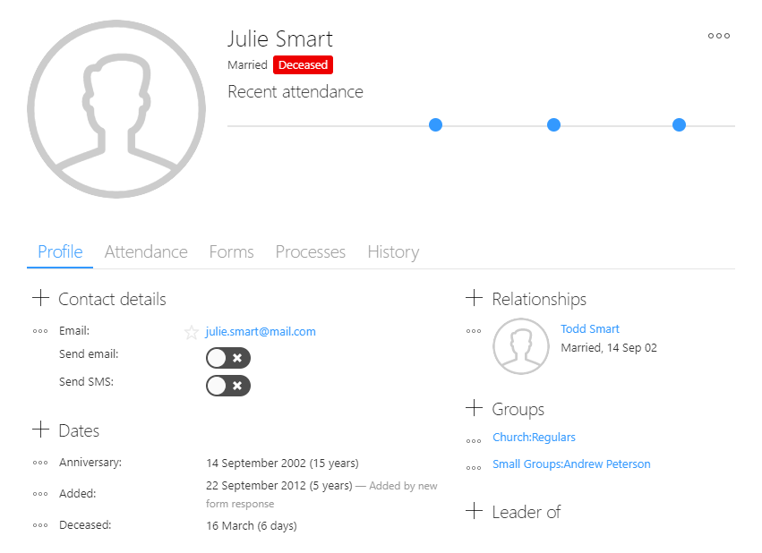

In the next image you can see that the deceased indicator is clearly displayed in the relationship section. You’ll also note that Todd, Julie’s husband is no longer listed as married but instead is now listed as a Widower. We’re still working on the widower update so you may not see that until next week. Also, any search groups that look for married people still includes people whose spouse is deceased. You can currently add a filter to exclude the deceased and if they are included you will clearly see that. This is an area we’d appreciate feedback on what your expectation would be here in regards to how deceased people should be included in search groups.

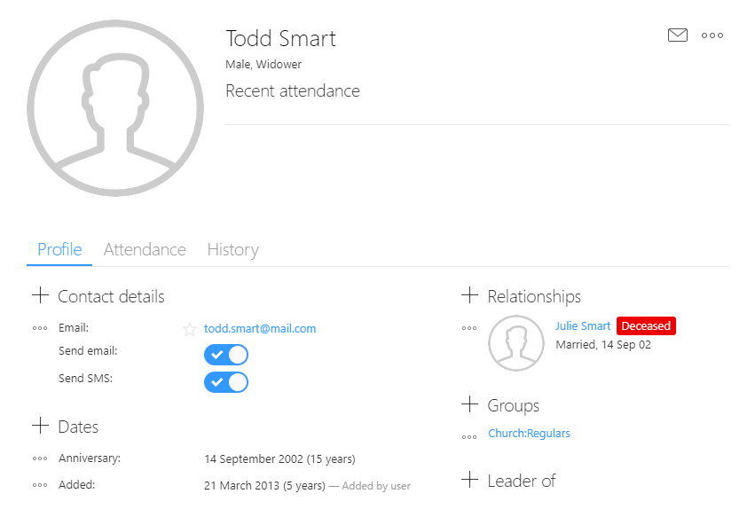

The following image shows the list of recipients for an email, in this case Julie has been included in the recipient list but as you can see her name is red and she is listed as deceased so the email won’t be sent to her email address. I see this as important as family members may be checking a deceased person’s inbox and the last thing a church wants to do is appear insensitive by continuing to send personalised email to the deceased person.

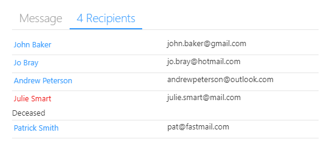

In a group you can see that the deceased indicator simply gets displayed next to the person’s name.

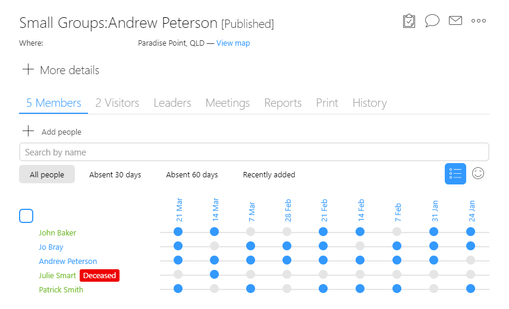

For meetings that a deceased person attended, again the deceased indicator is displayed next to their name.

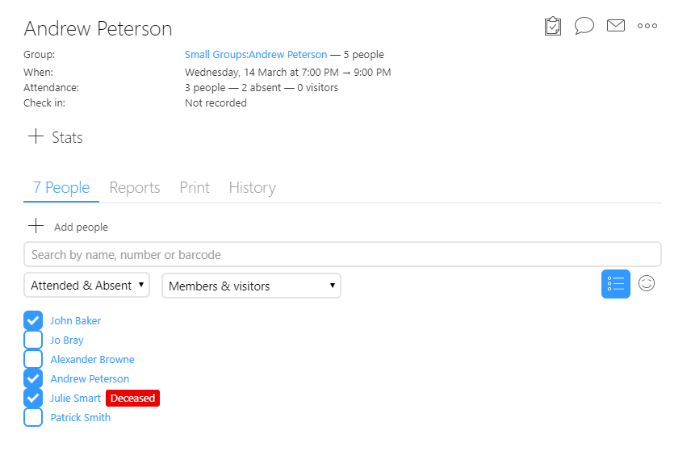

But for future meetings you can see that Julie’s name isn’t displayed. Churches often have volunteers or small group leaders recording attendance, so we don’t display people that have recently passed away as this would be insensitive and possibly distressing to both staff and volunteers. This is the same if it's an attendance report, deceased people are no longer displayed on attendance reports.

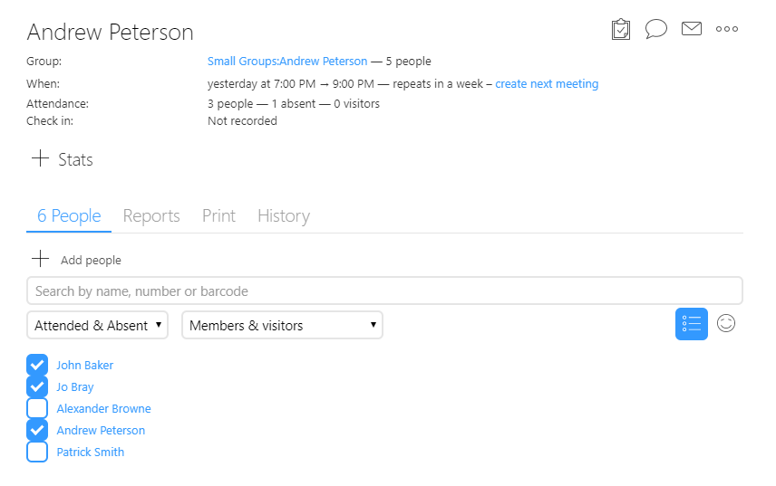

The final change we’ve made with relation to deceased people is that they are no longer included when we are counting the total number of active people at your church. As such you wont be charged for them going forward.

As I said before we want to hear from you, do you have other expectations on how we handle this info that we haven’t thought of? Also, now is a good time for your church to be thinking about how you care for family members if you haven't already. For example what processes need to be put in place, what follow up looks like and how can we set that up in UCare so that follow up isn’t forgotten.

To that end I’ve been thinking about how this could be an ideal opportunity to create an online forum where everyone can share their thoughts and processes for the various areas of church life. Not just bereavement services or counselling, but for things like child safety, event management and more. I’d love to hear your feedback here, would this would be of value to you and your church? If we get enough buy in we’ll set it up.

## Archiving profiles

For a long time we’ve had bulk archive options available that let you archive multiple at once, this option is now also included on profiles. You’ll find it just above the delete command when you press the … menu in the top right.

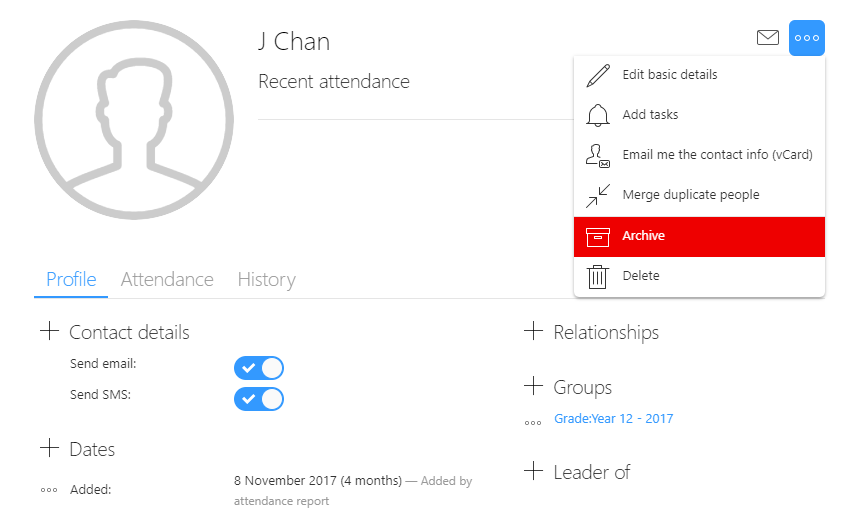

Archived in UCare means that the person’s isn’t charged for, currently we charge for a person if they are in a public group or if they have attended three or more meetings in the last 60 days. You could previously create a search group to view all your archived people but couldn’t easily see that if you were viewing the person’s profile. Now when you view an archived profile you’ll see an indicator to that effect listed under the name. If you hover over the Archived indicator it will show a description of what that means, just in case you’ve forgotten.

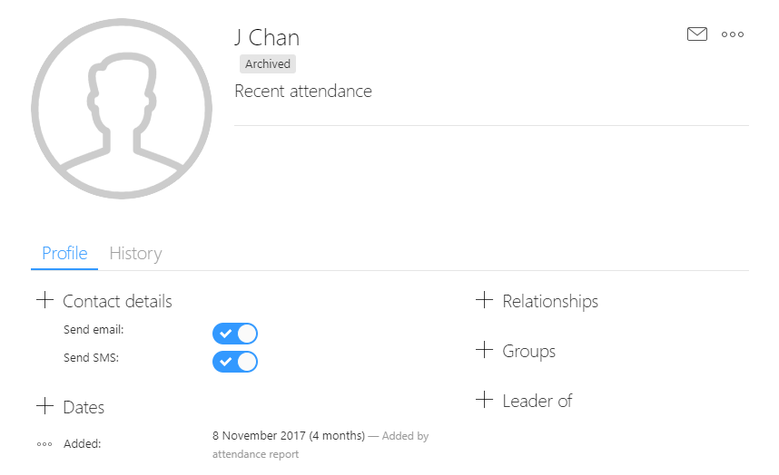

Because of how we classify people that aren’t charged for it means that recently added profiles are also classified as Archived (i.e. not charged for). Because of this we’ve added a seperate indicator that quickly lets you know when you’re viewing a profile that was added in the last 30 days. In the case of Tina she has the green “Recently added” indicator instead of the Archived indicator.

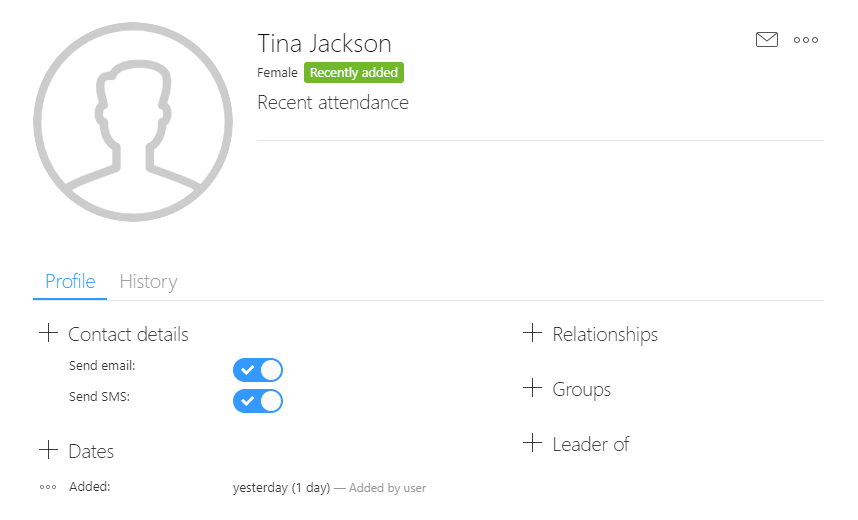

## Attendance of recently removed people

Until this week when people were removed from a group, then if they had attended in the last 60 days they still showed up in meetings and attendance reports. This often happens when people leave the church (e.g. if they moved to another city) or graduate to another school grade. Many churches still want to keep in contact with these people and so they don’t want to delete the people. But they also didn’t want their names in the attendance list’s as it meant more work.

From this week when you receive the attendance report recently removed people won’t be included. If those removed were removed by mistake then we’ve added a “Show recently removed people” option so that you can quickly see those people and mark their attendance. This will then add them back as a group member.

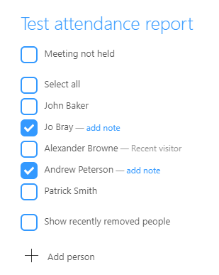

The filter options on meetings have also been updated so you can easily filter out the recently removed people from the list. As you can see in the following image there is now a drop down with a couple of new options. We recommend that you use the "Members & visitors" options so that the recently removed people aren’t cluttering up the list.

These filters were previously toggle buttons but because of the increasing number of options we had run out of space, as such we’ve turned them into drop down that are just as easy to use and require less room on the screen.

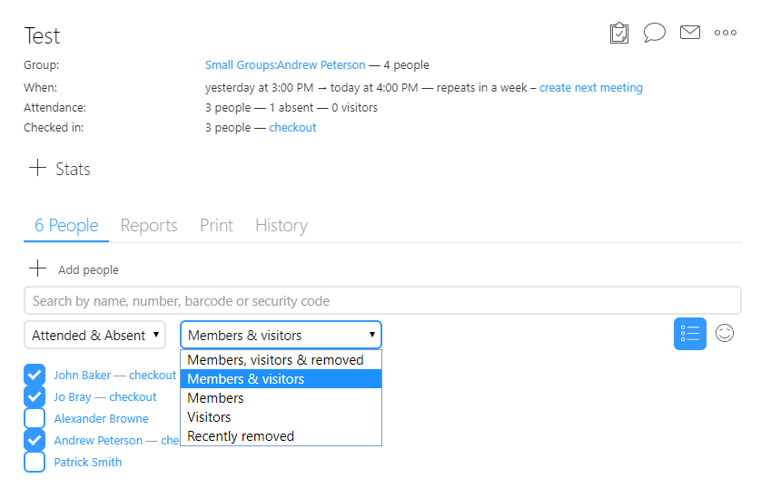

## Importing giving

A number of churches told us they are using separate systems for receiving giving and other payments. This often happens in countries that have domestic payment systems that aren’t used internationally or if they are migrating from another church management system, so we’ve added a payment import tool. Simply go to the import section and pick payments, then upload the payments in CSV format and tell UCare what info is in each column of the CSV spreadsheet. An example CSV file is included in case you aren’t sure what info to include and want a starting point to work from.

When importing the payments it will try link them to existing profiles using the people’s names, contact details or unique code. But if they don’t match you may want to use the Duplicate finder tool on the people page to help you merge duplicates. Also, if there is any info that UCare doesn’t directly support then you can import it into the payment’s note section so that it is included in any future reports that you run.

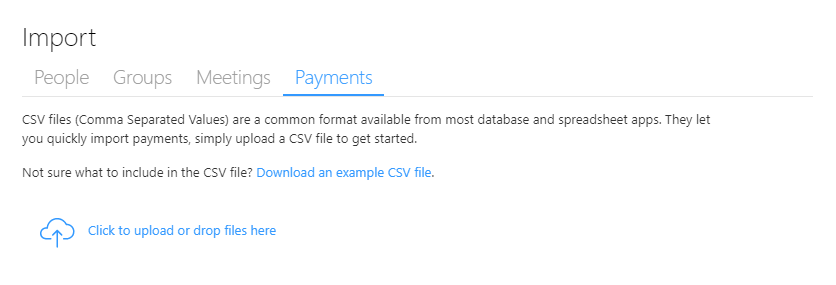

## Form gender options

Discussion of gender these days can seem controversial to some people. At UCare we don’t prescribe to tell you how to record your data but want to provide tools that help you do the best job of loving on people and starting them on a journey of knowing God and how God sees them.

Gender options on our forms have been coming up in a number of support tickets recently and so we’ve added a new options on the Person and Related Person questions. You can now choose to only show Male or Female options and not display unspecified.

Unspecified is meant as a “No response” answer but also gets used for people who identify as a non-binary gender. We’re looking at adding a fourth option to help better capture non-binary genders, at the moment we’re looking at using the term “Other”. But before we do I’d like to hear from you what your expectations and legal requirements are in this area.

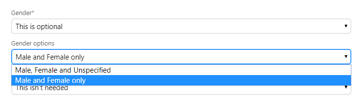

Forms also allow you to capture contact details and have those details update a person’s profile. While a profile allows a description to be included with a contact detail, for instance to record that the contact belongs to a parent forms haven't. The description is often included in camp attendee reports so that youth and kids teams have a hard copy of all the contact info they require. Forms now support the capture of a contact description as a question option so that you can now capture a description and know right away who or what it’s for.

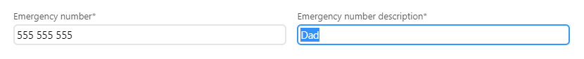

## Email verification

The last feature we’ve added this month is email verification. UCare allows you to send bulk email and you can select which email address you wanted to send the email from if you had added additional addresses. In the past you could add any email address and send from it even if you weren’t permitted to use that email address.

We’ve had a few cases where this has been abused of late and so we’ve now added a verification step. In future when you go into settings and add a new email address to send from; UCare will send an email to that email address. The person who receives it will then need to click the link in the email to permit use of that email address. If the person who adds the email address doesn’t have access to the email address and aren't given permission to use it then they’re now out of luck.

This may seem like a no-brainer but up until now we’ve not seen any abuse of this feature. But based on our monitoring systems and your feedback we’ve been able to tighten up the security in this area even more.

I really appreciate your feedback in helping improve UCare so feel free to email or tap the green help button and send your message.

Finally here’s a sneak peek at a new feature that’s going to be lighting up over the next couple of weeks, can any of you guess what it might be? Stay tuned for more info...

