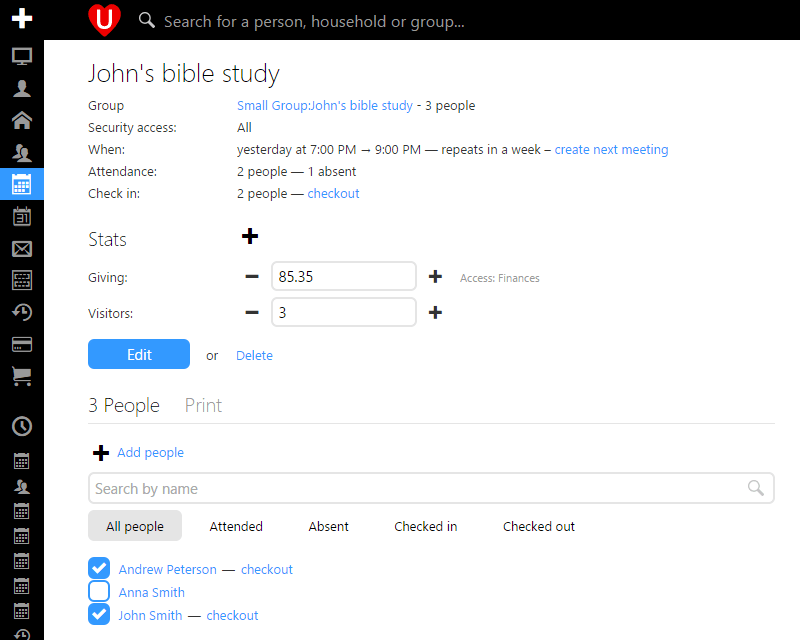
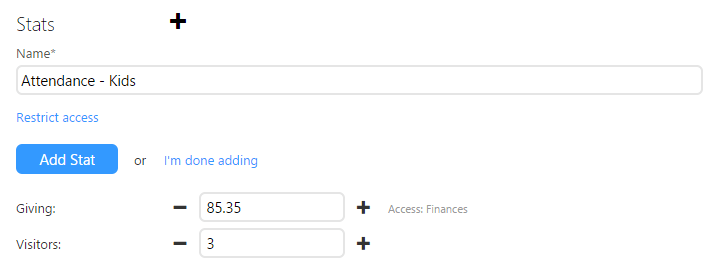
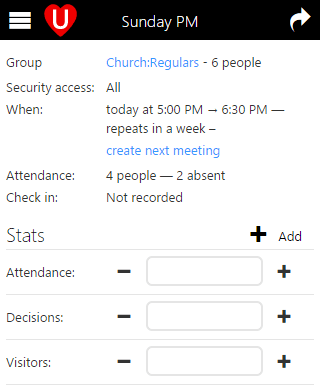

We've just rolled out another meeting update for you that will let you record various stats for your meetings. For example you may want to record an attendance number instead of each person in attendance or maybe the number of visitor bags you handed out or the number of volunteers. With meeting stats you can now record these and other stats, and if the stat you want to record doesn't exist then you can simply type in the name of a new one and it becomes available to everyone else.

At times you'll want to record stats that are sensitive and you don't want everyone to have access to, for example you may want to add a Giving stat. Like many other things in UCare you can restrict stats so that only people with the correct security area access will see it. In the example below the Giving stat has been restricted to people who have access to the Finances security area.

Often collecting these stats needs to happen during meetings, to help facilitate this we've optimized stats for easy use on smart phones and other small screen devices. This way a head usher can stand at the back of the room and tap the plus button to count each head or hand as if they were using a simple click counter.

With these and other updates we’re working hard to make UCare smarter and easier to use, if you have any feedback we’d love to hear from you, simply email support@ucarehq.com.