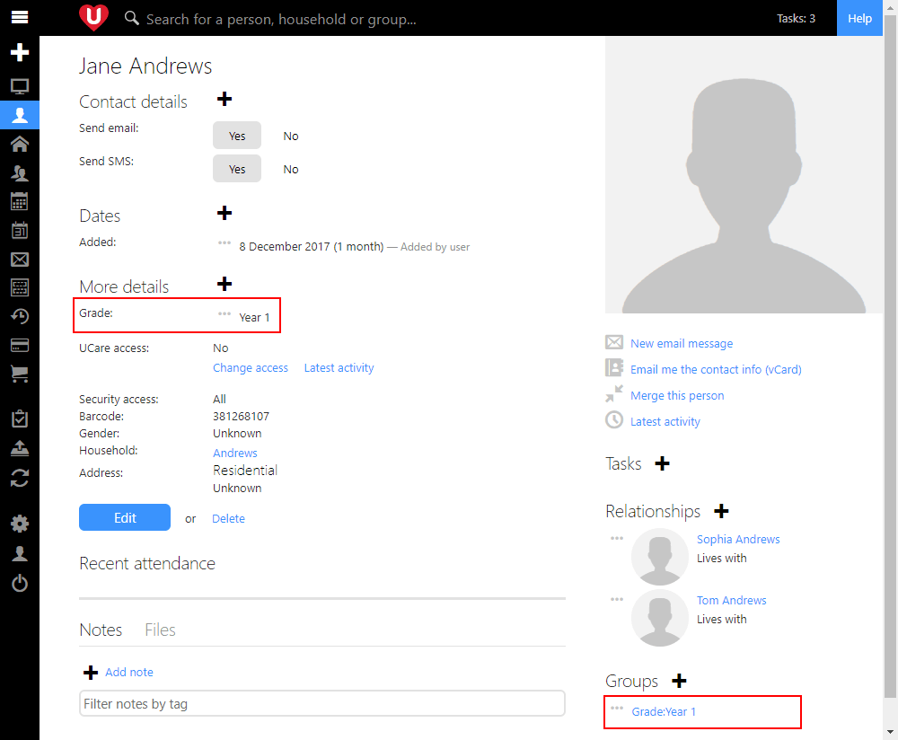
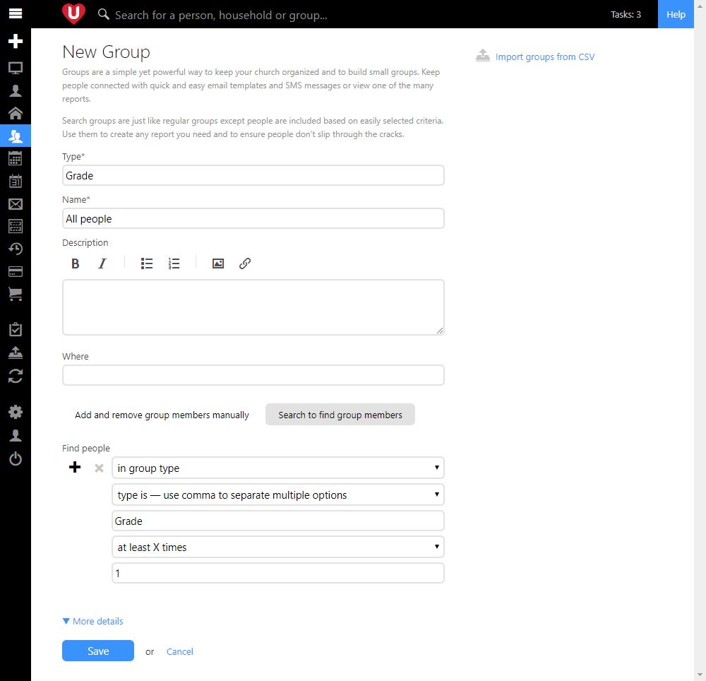
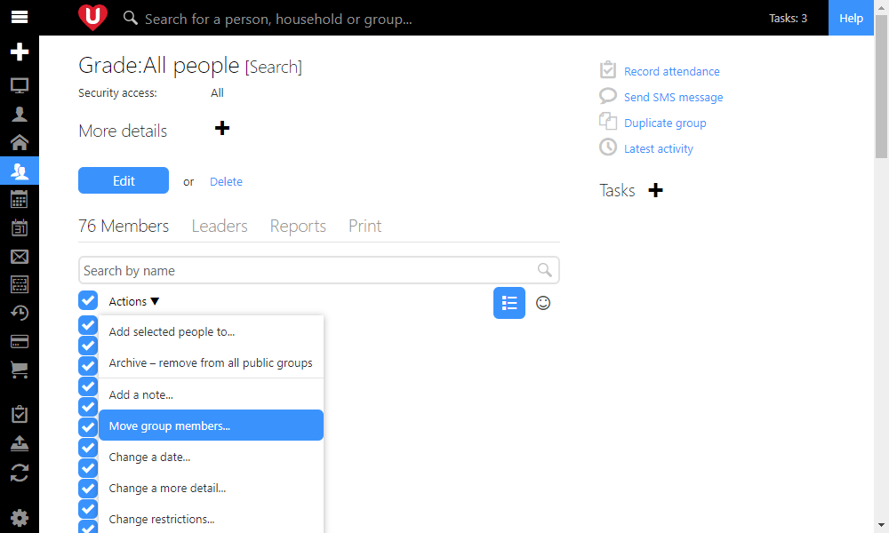
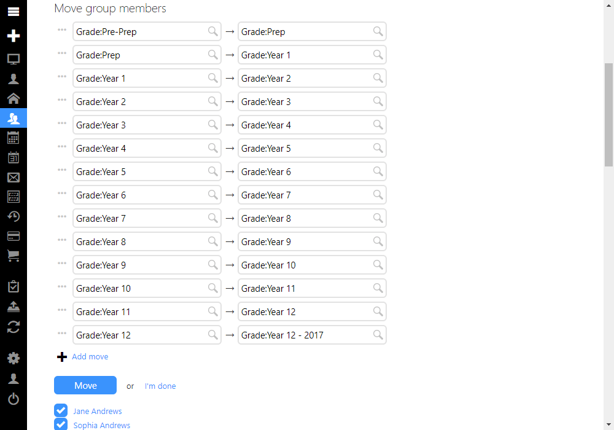
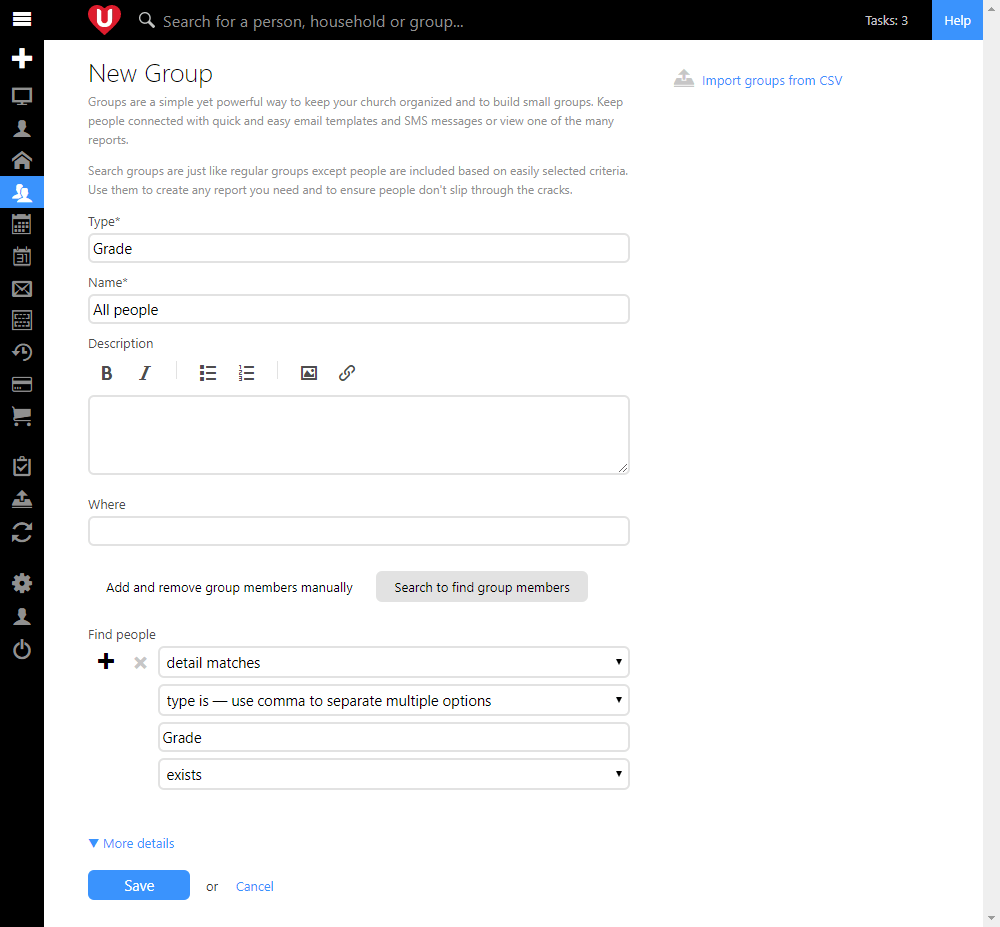
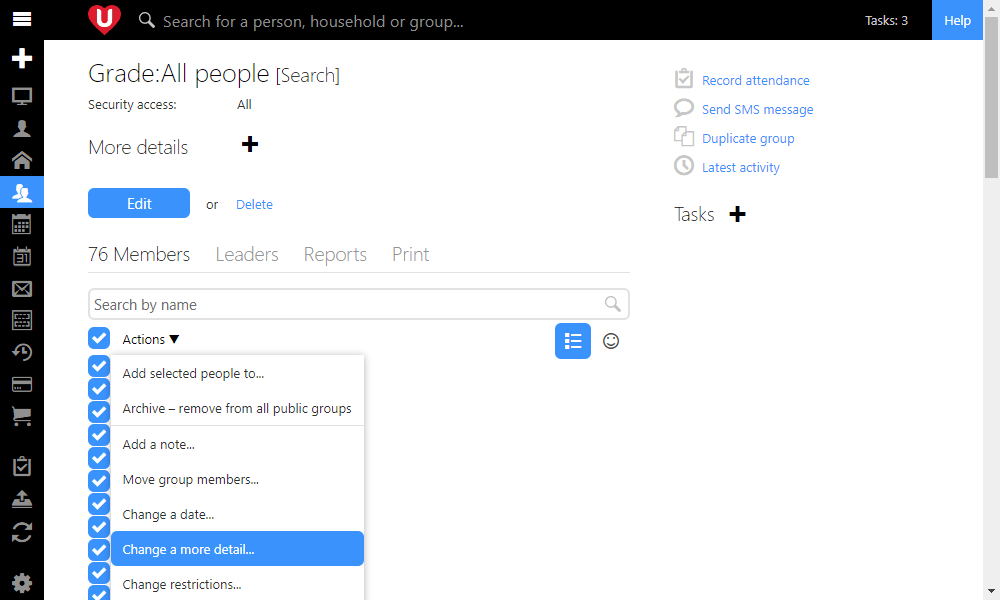
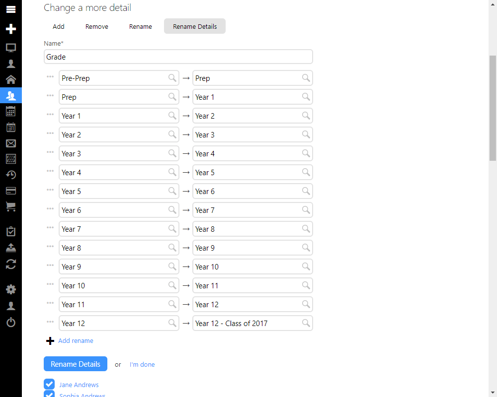

It's that time of year for many of our churches to be doing grade promotions for their youth and children's ministry. Today we're going to look at how you do these promotions yourself in UCare.

Last week we published an update to the groups features that was mentioned at the end of last year in the post [Thanks 2017, it’s been great!](/blog/thanks-2017-its-been-great/) Basically the group features were converted to use a new technology as part of an ongoing effort here at UCare to modernize the technology that we use. We're getting close to completing this conversion for all of UCare and its allowed us time to add some much needed new features, including these new group promotion tools.

In the following image two sections of the page have been highlighted, the **More details** section and the **Groups** section. These are the two options that churches use for tracking grade information. Churches often use groups to track grades, this lets them record attendance against that group and easily send bulk communications to a particular grade (or their parents). Alternatively we've found that churches migrating from other systems are more comfortable to track grades using the more details section of a person's profile. As such we're going to look at how to do promotions for those using groups and also those using more details.

## Grade promotions for groups

The first thing you'll want to do when doing a group based promotion is get a list of all the people in a Grade group. The following image shows the options to select to create a search group that finds all people in a Grade type of group. If you are a multi-site church then you may need to add extra filters to filter down to a specific campus, state or country.

After you save the search group select all the people by clicking the check box at the top of the list of people, then click **Actions > Move group members...**.

The final part is to enter each of the promotions. For example from Year 1 to Year 2, then tap **Add move** to add another promotion, for example from Year 2 to Year 3.

Once you have all your grade promotions entered in correctly click the Move button. When you do this UCare will move each of the selected people from their current grade to their new grade.

Something to note here is that if for some reason a person is in two groups, for example Year 1 and Year 2 then once the move is complete they will now be in the Year 2 and Year 3 groups.

### Advanced

Sometimes you will have a grade that has children of multiple ages and you only want to promote the older children. For example you may have a grade with 2 and 3 year olds called Explorers and you only want to promote the 3 year olds. In this case you should create a search group with two filters.

1.  Find people who are members of the Explorers group.
2.  Find people who are 3 and older.

Once you have this search group you can select all the matching people and then use the **Actions > Move group members...** option to move just the selected children to the next group.

## Grade promotions for more details

The first thing you'll want to do when doing a more detail based promotion is get a list of all the people with a Grade more detail. The following image shows the options to select to create a search group that finds all people with a Grade type of more detail. If you are a multi-site church then you may need to add extra filters to filter down to a specific campus, state or country.

After you save the search group select all the people by clicking the check box at the top of the list of people, then click **Actions > Change a more detail...**.

The final part is to select the "Rename details" option and then enter each of the promotions. For example from Year 1 to Year 2, then tap **Add rename** to add another promotion, for example from Year 2 to Year 3.

Once you have all your grade promotions entered in correctly click the Rename Details button. When you do this UCare will rename the corresponding detail for each of the selected people.

Something to note here is that if for some reason a person has two Grade more details, for example Year 1 and Year 2 then once the rename is complete they will now have Year 2 and Year 3.

### Advanced

Sometimes you will have a grade that has children of multiple ages and you only want to promote the older children. For example you may have a grade for 2 and 3 year olds called Explorers and you only want to promote the 3 year olds. In this case you should create a search group with two filters.

1.  Find people that have a "more detail" of type "Grade" where the Detail is Explorers.
2.  Find people who are 3 and older.

Once you have this search group you can select all the matching people and then use the **Actions > Change a more detail...** option to rename details for just the selected children.

With these and other updates we’re working hard to make UCare smarter and easier to use, if you have any feedback we’d love to hear from you, simply tap the green help button and send your message.