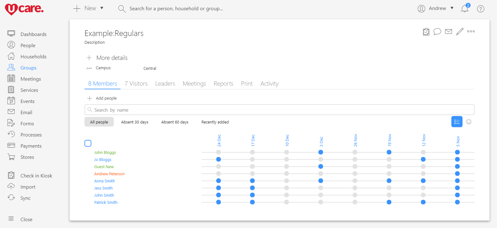

2017 was by all accounts an enormous year for the team here at UCare. So before 2017 ends we want to take a moment to look at what has been achieved. We also want to say thank you to all our dearly valued churches, the churches that choose to use our tools to do church better. Finally, we’ll take a look at all the things planned to make UCare an even more helpful tool in 2018.

## Modernizing UCare

Over the last eighteen months, our team has been working on a project to modernize UCare. UCare was born 10 years ago in a time referred to as Web 2.0 (a term the broadly meant dynamic websites often created using jQuery). The Web 2.0 technology worked wonderfully to create simple interfaces but as our team and functionality has grown; it’s become harder to test and add new features.

About 2.5 years ago our engineers trialed using a new technology called React (developed at Facebook); it worked wonderfully in addressing the issues with the previous technology. Our team started about eighteen months ago the process to convert the rest of UCare to use React, this decision was made after seeing how well the new React based functionality worked in production. As this project has continued, the pace that long awaited features were delivered has increased, while also avoiding side-effect bugs that were previously not uncommon when adding new features using the older technology.

Converting the dashboard, people, meetings, events, email, forms, processes, payments and settings to React was completed during 2017. Come January 2018 the final parts of the conversion to React will be published, that remaining parts being groups, check in and stores.

## Scheduling & Visual Redesign

At about the same time that the final parts of the React conversion is published the new scheduling features will arrive that have been in development for the last eighteen months. Along with these new scheduling features, we are very excited to deliver a visual refresh of UCare. The redesign has been a behind the scenes focus for our team as part of the conversion of UCare to use React. Following is a sneak peek of the almost finalized new design. The new design should be familiar to existing users, but makes better use of screen space while improving the use of new “crisp” branding and ascetics released during 2017. Eagled eyed viewers may have even noticed the new Services item in the navigation-bar.

## Something for the Dev’s

The new scheduling features were created using the same React technology that has been used for modernizing the rest of UCare. However, we decided to go even further, and in doing so created something a little bit special for the developers that you may have on your team.

Many web-based apps these days provide a REST interface for interacting with your data, and UCare is no different. While REST interfaces are great for allowing your team to create custom solutions they suffer from two main problems. First, you often need to make many requests to this interface to get or update all the data you need. Second, the REST interface is often not the same interface that the app uses to access your data, and so the interface can be limited in what you can do. When our team set out to create the new scheduling features they wanted to do it in a forward-looking way and so they spent the first six months of the project creating a new interface based on GraphQL, or Graph Query Language.

### So what is a graph?

A graph is a mathematical term that describes how one piece of data connects to all the other pieces of data in your account. With GraphQL, you don’t make multiple requests to different parts of the interface to get all your data. Because GraphQL knows how all the data is connected, a developer instead writes a query that specifies exactly the required data and the GraphQL interface passes exactly that. This means less complexity for developers, and is more efficient for both your developers and our systems. The fact that the new scheduling features are built with the exact same GraphQL interface that you’ll have access to means there won’t be any missing data, and as new features are added, you’ll see them right away.

## But that’s not all

While some of our team has been working on these larger projects, the rest of the team has worked on delivering the following valuable updates.

*   ### Forms
    
    2016 saw a complete rewrite of forms and yet in 2017 forms received quite a large update again. Here’s a few of them:
    
    *   New options help avoid the creation of duplicate profiles.
    *   It’s now possible to email forms so that the recipients can update their UCare profile; this can even load existing info from the recipient’s UCare profile.
    *   Sets of questions can be linked to person questions and easily duplicated; this is great if you aren’t sure of the number of people in a family.
    *   New form automation options allow a person to be added to a process or group based on their response to a question, or if their UCare profile is new or existing.
    *   The process step to add a person to when a form is completed can now be selected; this enables a person’s response to move them through a process without a user’s involvement or the recipient needing access to UCare. This is great to automate many use cases and no passwords means people have one less to remember (or probably forget).
    
*   ### Events
    
    Event management in UCare has been a very powerful feature for a long time. However, overtime there have been extra options that we wanted to add from your requests. These seemed like simple requests that actually weren’t easy for us to achieve. As part of converting events to using the new React technology our team has finally be able to complete many of them. Events sections for a long time have had “Fields” that allowed you to specify extra questions to ask with each ticket, they were great but very limited. It was decided that because the new forms have such comprehensive abilities they would be perfect to reuse them. However, it was also realized that this would require some time to migrate everyone.
    
    *   You can now link an event (or a ticket type) to one or more forms, but the forms are displayed after the booking is paid. The plan is to change this soon but there is a technical limitation holding this up. The limitation means everyone currently using the limited Fields need to migrate to use Forms instead. We’ll be talking more about this migration in 2018.
    *   Sections have been renamed to ticket types, sections was an appropriate word if you were running an event at a conference venue where there were seating sections. However, the term didn’t make sense for other events and so we took this opportunity to rename sections to Ticket types. Now these can still be used for seating sections, but they are far more reflective of the other ways Ticket types are used.
    *   Events and Ticket types can now be linked to processes, which enables you to automate various things related to the people booking the tickets.
    *   Events and Ticket types are now linkable to a tax or discount code.
    *   Discount codes can be percentage off or fixed amount off. You can even apply them to all booking in a date range, in effect creating early bird rates without having to create multiple Ticket types as was previously required.
    *   Some customers told us that certain ticket types (e.g. that provide a service like lunch) required a tax to be charged and the taxes were different depending on the state or country that the church campus was in so options have been added for that.
    *   Additionally multiple payment services we added so that you can collect payments into the correct bank accounts for each campus of the church. Some churches are even using this per ministry, for example, youth camp funds are going directly into youth bank accounts.
    
*   ### Phone number formatting
    
    During January 2017 UCare started formatting phone numbers based on the each person’s country. This is a nice time saver so that numbers always display the same way.
    
*   ### Optimize database queries
    
    One of our engineers focused on reviewing our database code looking for opportunities to improve performance even more. This work has been most notable in the speed of reports and search groups and has seen the load on our servers drop by an amazing 75%. This means that the speed of many operations now feel faster.
    
*   ### Attendance report notes
    
    As part of converting the attendance-report to using React the ability to include notes with each person on an attendance report was added. These notes are both sent to the group leaders and securely added to the person’s profile.
    
*   ### Duplicate finder
    
    While converting the duplicate finer to use React time our team optimized the search speeding up the process of finding duplicates almost 1000%. A new matching algorithm was also added that makes it far more accurate and reliable to match duplicate profiles.
    
*   ### New caching infrastructure
    
    Caching helps reduce the amount of work our servers do and speed up how quickly content is delivered to your device. A new global cache was deployed in 2017 that has seen the load on our servers drop by a third while also reducing the total load time of most pages by half. In 2018, more work in this area is planned to help greatly speed up search.
    
*   ### Email history record
    
    The first addition made in regards to in email in 2017 was to start recording every email that a person receives. This was you can view each person’s history to see the messages sent to them.
    
*   ### Email with recipient preview
    
    The email editor was the next part converted to React, which allowed the following:
    
    *   Added a new file attachment picker that lets you select multiple attachments easily; and in a manner that doesn’t affect how many email messages successfully arrive in people’s inboxes. In particular, PDF attachments previously had a large impact on if email arrived in recipients’ inboxes.
    *   The new React editor now display’s a list of all the recipients and any reason each of them may not receive the email. Previously you were a little bit in the dark about why people didn’t receive a message but this has greatly helped many people see issues early. Expect to see continued investment in the area of email delivery in 2018. We want to make it easier for you to understand why someone didn’t receive a message and who actually received and opened the messages that you receive.
    
*   ### Church metrics
    
    2018 will see custom dashboard options arriving so that you can create better reports. Some customers contacted us though and asked about Church metrics as they needed a solution sooner. Church metrics is a free and easy to use solution that was not a lot of work to add. Our team added it to Sync center so that you can create simple dashboards, meanwhile our engineering team will finish off the new dashboard features in UCare.
    
*   ### Zebra printer support
    
    For a long time UCare has only supported DYMO printers for printing nametags and security tickets. DYMO printers are cheap and available from many businesses selling office supplies. They normally work fine if you regularly run cleaning maintenance but when you need rock solid printers for hundreds of check-ins they still don’t quite hit the mark. DYMO printers have also had a number of problems over the last couple of years because they were using an old technology that all major web browser’s stopped supporting. For our larger customers support for Zebra printers were added. For a fast reliable solution, Zebra printers are about six times faster and almost never break down. They’ve been such a success that this option is now available to everyone; it requires some setup so if you’re interested please contact support to find out more.
    

## 2018, we can’t wait

While we loved what was achieved in 2017, it’s actually just the beginning in many ways and probably wasn’t even that noticeable to you. The React changes that are almost complete has created a launch pad that will allow even more value to be delivered to all the churches we support in 2018 and beyond. Here’s some of the things that are on our list for 2018. Please understand that dates on these things aren’t all locked in yet and thing can and often do change, but it gives you a general idea of where UCare is going.

*   ### Support
    
    Many more customers joined UCare in 2017; unfortunately, this has slowed our support team down some and stretched our support systems a little. Previously some of our team had shared responsibilities that meant they were pulled away from support at times as priorities dictated. We plan to address this in 2018 as we focus on growing our dedicated support team. We believe that the best sales team you can have is a great support team and the plan is to deliver a better support experience in 2018. New support options tailored for our larger customers are also coming so keep an eye out for that.
    
*   ### SMS
    
    For many years, UCare has relied on a company called Clickatell for delivering SMS at some of the cheapest rates. Unfortunately, this year they stopped offering new customers the package that allowed this. Early in 2018, SMS options will be provided directly in UCare. The costs will simply show up on your UCare invoice and won’t require any configuration to get it working.
    
*   ### Scheduling & GraphQL API
    
    As mentioned above the new Scheduling and GraphQL options will be arriving early in 2018.
    
*   ### React
    
    This new technology will be everywhere in UCare in 2018. The last parts of the conversion work will be published early in 2018. This will reduce the maintenance that our teams need to do on ageing systems so that the focus is on delivering new value.
    
*   ### New Check-in
    
    Included in the new React conversion will be an entirely new Check-in experience. Check-in is a very important system for most of our customers so the plan is to roll this out in three stages so that check-in doesn’t break. The most reassuring part of this rollout is probably that the current Check-in kiosk won’t be going away until we are certain that everything is working as well as it currently does. Really though the hope is that it works much better and is more customizable for each church’s needs.
    
*   ### Brother printer support
    
    Included in the new kiosk will be support for Wi-Fi Brother Printers. This will mean that finally you’ll be able to print directly from your Android and iOS devices without needing a laptop or computer to run the printer.
    
*   ### Apple & Google Pay
    
    As part of the work to convert events to React the team have been working on adding support for Apple Pay and Google Pay. Currently people need to enter all their details each time they make a payment or register for event. With the new payment options the person will simply tap a confirm button on their phone and Google or Apple will look after verifying them (via pin, touch or face ID). This will then provide the info UCare needs to complete the transaction and process the payment.
    
*   ### Dashboards
    
    Church metrics has been a great interim solution for many churches but we want to enable you to add even more stats to dashboards reports. These dashboards will contain all your most important stats so that you can see it all at a glance, and they will update in real time so that you always have the most up to date info. This will allow leadership to make better decisions based on real stats.
    
*   ### More automation options
    
    More automation options are coming, they’ll allow you to trigger actions when certain events occur or when certain conditions are met. The hope and expectation is that this will allow ministries of all sizes to automate more of the mundane work so that you can focus more on the people.
    
*   ### New security
    
    A new user management section will be added to UCare in 2018 that will allow more fine-grained control over what people can see and do. At the same time, role-based access management will be added so that it is much easier for admins to manage access for large numbers of people.
    
*   ### More localization
    
    Once conversion of UCare to React is completed, it opens up some great options in terms of localizing the user interface for different languages. Our team has already completed some of this work with displaying dates and currencies in localized formats. The next part the team will tackle is localizing system emails. From there work will continue to enable full localization of UCare in to each user’s native language.
    
*   ### New search builder
    
    While the search group builder is quite powerful, it has seen the number of options explode as new features are added. With scheduling and other features arriving in 2018 the search-builder will also be updated, the update will simplify the language and options so that this great can be understood and used by more people. The search builder will also be added to the people page so that you can filter the list of people on the fly. This means you can filter people without having to create a search group each time you want to run a quick query.
    
*   ### CCLI & Sharing of songs
    
    The work done on scheduling focuses on people and teams. Once the scheduling experience is working well CCLI support will be added along with the ability for your worship teams to organize, transpose and share all the songs they need.
    
*   ### Resources & Reservations
    
    Scheduling will also get the ability to reserve various resources later in 2018. So you‘ll be able to manage rooms, or moveable resources (e.g. chair’s). See who has made the reservation, what the reservation is for and resolve reservation conflicts between different departments as needed.
    

We hope that you’re excited as we are about all that’s happened and the plan for 2018. Over the next few weeks, we’ll be taking a closer look at what some of the new 2017 features enable and how you can start using them. So stay tuned and you may even get to see a couple more sneak peaks before you finally get access to scheduling.

Thanks for taking the time to read, and thanks for all the feedback. We’ve built plenty of it into the redesign and new features.

We hope you had a wonderful 2017 and look forward to working with you more throughout 2018.

Blessings,  
From the UCare team.