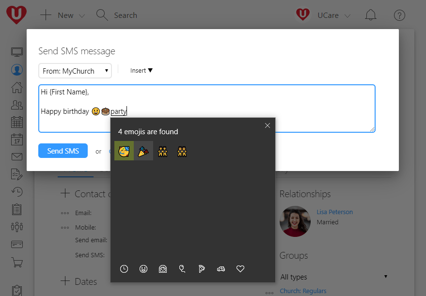
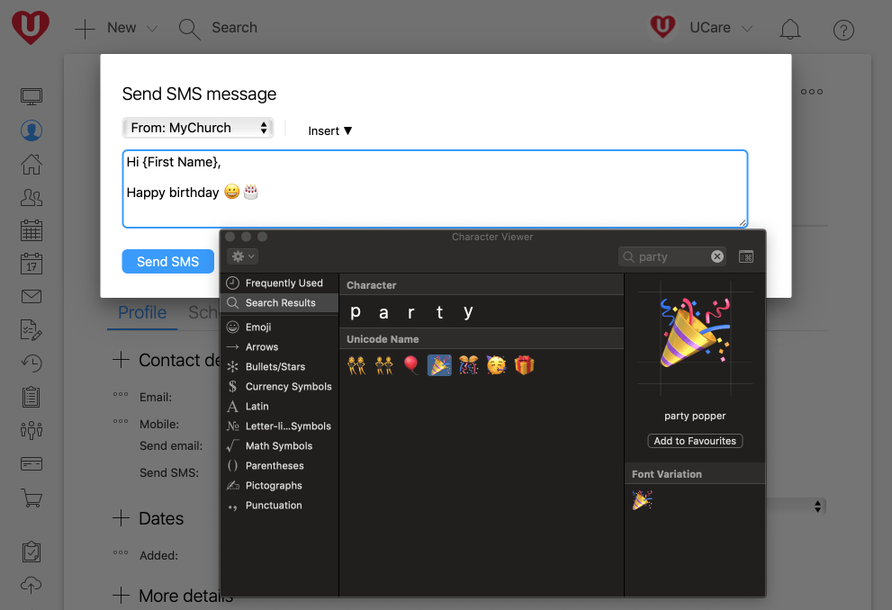

For those churches that are using the bulk SMS features in UCare we wanted to share a quick tip on inserting emoji (e.g. 😃😍🤣🤷‍♂️👍✝) when using Windows 10 or macOS.

### How to insert emoji on Windows 10

1.  Place the keyboard cursor at the point where you want to insert the emoji.
2.  Use the keyboard shortcut **WIN + .** (the period / full-stop punctuation mark) to open the character viewer.
3.  Click on the emoji that you want, keep clicking until you have inserted all the emoji you want. You can even type a word to find the right emoji.

 

### How to insert emoji on macOS

1.  Place the keyboard cursor at the point where you want to insert the emoji.
2.  Use the keyboard shortcut **Control + Command + Spacebar** to open the Character viewer.
3.  Double click on the emoji that you want, keep double clicking until you have inserted all the emoji you want. You can search to find just the right emoji.

If you'd like to enable bulk SMS for your UCare account, please have a person with admin access visit **Settings > SMS** and request SMS activation. Alternatively, you can use the UCare app on your Android or iPhone to send SMS using the free credits included with your phone plan, and of course you can easily insert emoji on your smartphone.