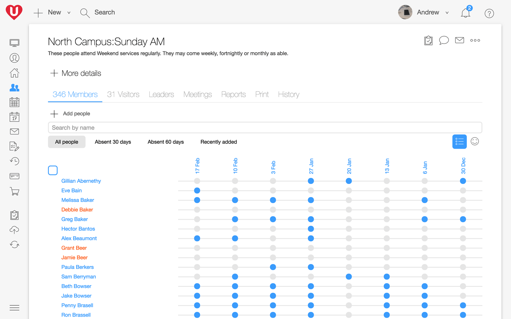

## Stop people falling through the cracks

People at your church are going through difficult times, be it financial, health, relational or something else. Knowing when a person attends so that you know when they don’t is a key ingredient to showing them they’re valued.

## Track how people connect

UCare looks after requesting attendance reports from your small group leaders. Mark-off who was there, add notes and the report is done. Experience has shown that small group leaders often forget passwords so don’t submit attendance, that’s why we created a secure reporting method that avoids the need for passwords.

Your small group leaders can again help with service attendance or your connection team can pull up the app and mark-off the people that they welcomed. When it comes to ticketed events, open the app, scan tickets, check people in and print name tags. All this attendance info is then used to generate individual, group and church health reports, and allows you to proactively follow up with people.

## Still more attendance options

*   **Unlimited** groups & times.
*   **Unlimited** people & households, only pay for regular attendees.
*   **Touch ID or pin-code security** so sensitive info isn’t easily accessed by others on your phone.
*   **Multi-site**
*   **Automate follow-up** with [Processes](/features/processes-automation/).
*   **Track custom stats**, like giving, head count, decisions, it’s up to you really.
*   **Add new people** as part of attendance reports.
*   **Add photos in a snap** with a phone or tablet’s camera.
*   **View a variety of reports**, absent, attendance, new people, birthdays, medical, etc.
*   **Custom searches and reports**.
*   **Download reports** in CSV or PDF format.
*   **Flexible data import & export**; including unlimited custom fields.
*   **Send bulk SMS or email** directly from UCare.
*   All UCare activity is **fully audited for data privacy** reporting needs.
*   **Optimized for low bandwidth** internet, no offline mode.
*   **Encrypted internet connection** to protect all data.
*   Supported on Google Chrome, Safari, Firefox, Edge and Internet Explorer 11+.
*   The mobile app is supported on iOS 8+, Android 4.4+ or Windows Phone 8+.

### Get started quickly

Import your people, create a meeting schedule and start marking-off attendance. The set up options will grow as you need and we’re there to guide you with every step.

### People that care

We know it is frustrating when thing don’t work as expected, that's why we invest in a great support team to help with questions you have. We also have plenty of articles, videos and training available.

### Continual improvement

We’re always refining and improving based on our customer’s usage and needs. We want to work together to make UCare even better, when you have an idea or feedback feel free to share.