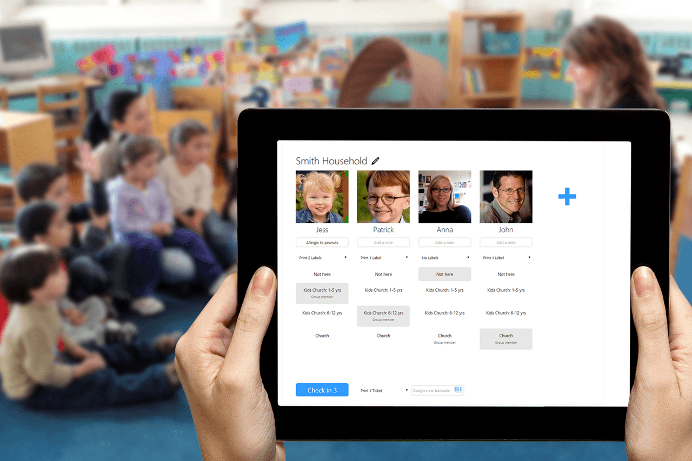

## Speed up, secure and simplify check-in & reporting

Your children’s ministry is often the first contact visitors have with your church. A quick & secure check-in process makes for a great first impression and builds trust that your church cares about their child’s safety.

<iframe src="https://www.youtube.com/embed/ks6ClSiBBHk?feature=oembed&amp;autoplay=1&amp;start&amp;end&amp;wmode=opaque&amp;loop=0&amp;controls=1&amp;mute=0&amp;showinfo=1&amp;rel=1&amp;modestbranding=0" class="video-iframe" allowfullscreen></iframe>

## Fast and secure check-in

Whether your children’s ministry is large or small, UCare makes it quick yet safe to check children in or out of classes using any device, even your smartphone. Printed nametags can include medical & contact info, class and more. It’s also easy to print extra labels if the child has a bag or other item that needs a label. UCare supports low cost RFID key tags for a real speed & security boost when checking in regular families. The parents simply swipe their tags and nametags print, for extra safety we recommend you check in volunteers too.

## Still more check-in options

*   **Unlimited** classes, rooms, age groups, times.
*   **Unlimited** people & households, only pay for regulars.
*   **Unlimited** check-in stations, phone, tablet, laptop or desktop.
*   **Touch ID or pin-code security** so sensitive info isn’t easily accessed by others on your phone.
*   **Manned Check-in** for registering & checking in visitors, updating personal info, and check-out.
*   **Self Check-in** so regulars can quickly check-in themselves.
*   **List Check-in** for room check-in & check-out.
*   [RFID or barcode key-tags](https://ucare.zendesk.com/hc/en-us/articles/201954284-Barcodes-and-RFID-tags) for **10 second check-in** & enhanced check-out security.
*   Alternatively use printed **security labels** with security code for check-out.
*   **Multi-site**
*   **Easily transition** children from auditorium, to class room, to toilet and back.
*   **Quickly locate children** at check-out time.
*   Create **[custom forms](/features/forms-and-surveys/)** for registration & consent.
*   **Automate follow-up** with [Processes](/features/processes-automation/).
*   **Track custom stats**, like giving, head count, decisions, it’s up to you really.
*   **Add or update families & people** on the fly in manned and list check-in.
*   **Add photos in a snap** with a phone or tablet’s camera.
*   **View a variety of reports**, absent, attendance, new people, birthdays, medical, etc.
*   **Custom searches and reports**.
*   **Download reports** in CSV or PDF format.
*   **Flexible data import & export**; including unlimited custom fields.
*   **Parent/guardian name & phone** printed on nametags for quick contact.
*   **Or send SMS directly from UCare** to the parent/guardian.
*   **Allergies, medical and notes** are printed on nametags.
*   **Birthday cake icon** for birthdays this week printed on nametags.
*   Icon for **Absent over three weeks** printed on nametags.
*   **New person** icon printed on nametags.
*   **Track police check** requirements & renewals for volunteers.
*   **Handle split families** or custody disputes securely.
*   **Wireless nametag printing**
*   Zebra & DYMO printers supported, and coming soon wireless Brother printers.
*   Customizable labels (nametags).
*   All UCare activity is **fully audited for data privacy** reporting needs.
*   **Optimized for low bandwidth** internet, no offline mode.
*   **Encrypted internet connection** to protect all data.
*   Supported on Google Chrome, Safari, Firefox, Edge and Internet Explorer 11+.
    The mobile app is supported on iOS 8+, Android 4.4+ or Windows Phone 8+.

### Get started quickly

Import your people; including children, create a meeting schedule and start checking in. The set up options will grow as you need and we’re there to guide you with every step.

### People that care

We know it is frustrating when thing don’t work as expected, that's why we invest in a great support team to help with questions you have. We also have plenty of articles, videos and training available.

### Continual improvement

We’re always refining and improving based on our customer’s usage and needs. We want to work together to make UCare even better, when you have an idea or feedback feel free to share.