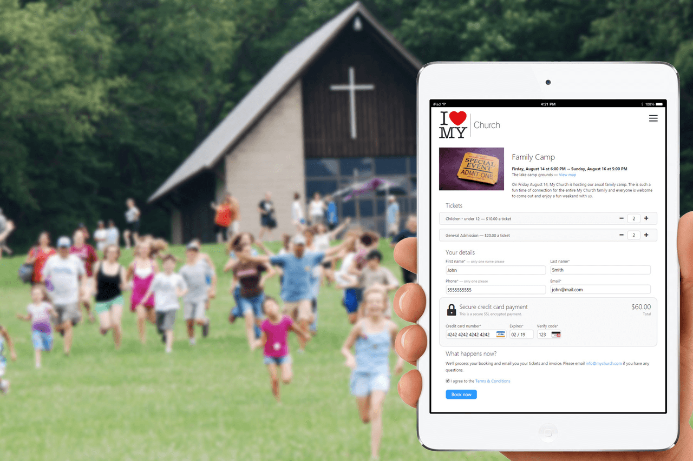

## Simplify ticket sales & event management

Planning & promoting events can be a lot of work. UCare can help with email promotion, online registrations & payment processing at a great rate.

## Make your event a success

Easily handle different pricing levels, optional extras and collect extra attendee info such as age, medical and emergency contact info during purchase. At the event you can quickly scan & validate tickets with the UCare app, print name tags, issue refunds, track attendance as well as plan venue capacity and staff requirements.

## Still more event options

*   **Unlimited** events & ticket types.
*   **Unlimited** attendees, only pay for regular attendees.
*   Run **classes, camps, outreach** events and more.
*   **Touch ID or pin-code security** so sensitive info isn’t easily accessed by others on your phone.
*   RFID wristbands speed up lines with **2 second check-in**.
*   Reports for **sales, refunds, attendees** and more.
*   **Custom searches and reports.**
*   **Download reports** in CSV or PDF format.
*   **Flexible data import & export**; including unlimited custom fields.
*   **Send bulk SMS and email directly from UCare** to attendees.
*   Publish **event pages on our website**.
*   Or easily embed **event pages on your website**.
*   **Publish an event calendar** to our website or yours.
*   Quickly **validate tickets at the door** with the mobile app.
*   Express check-in **group bookings**.
*   **Group discount** options – promo codes coming soon.
*   Multiple **early bird ticket pricing** levels.
*   Set **capacities for each ticket type**.
*   Optionally **print attendee nametags** at check-in.
*   Scan tickets to **record attendance**.
*   Run single or **multi-day events**.
*   Staff can **manually register attendees**.
*   Change event page design with **custom CSS**.
*   **Customize design** of each ticket type.
*   **Provide directions** with event location & maps.
*   Customize attendee **terms & conditions**.
*   **Responsive** event pages.
*   Inbuilt **email promotion** or sync to MailChimp.
*   Add **analytics tracking**.
*   **Run free events or paid.**
*   **No per ticket fees** from UCare.
*   **Issue refunds,** both cash & Card.
*   Payments in person or online via **PayPal and Card**.
*   **Avoid capacity problems** from no-shows by charging refundable deposits.
*   **Over 100 currencies** accepted by our payment processors.
*   **Flat monthly card processing** fees with PushPay.
*   Or card transaction **rates start at 1.75% + 30c per transaction** with Stripe.
*   All UCare activity is **fully audited for data privacy** reporting needs.
*   **Optimized for low bandwidth** internet, no offline mode.
*   **Encrypted internet connection** to protect all data.
*   Supported on Google Chrome, Safari, Firefox, Edge and Internet Explorer 11+.
*   The mobile app is supported on iOS 8+, Android 4.4+ or Windows Phone 8+.

### Get started quickly

Enter an event name, time, location and description. Add your ticket types and publish your event. Send out promo email and grab the app to quickly validate tickets at the door. The set up options will grow as you need and we’re there to guide you with every step.

### People that care

We know it is frustrating when thing don’t work as expected, that's why we invest in a great support team to help with questions you have. We also have plenty of articles, videos and training available.

### Continual improvement

We’re always refining and improving based on our customer’s usage and needs. We want to work together to make UCare even better, when you have an idea or feedback feel free to share.