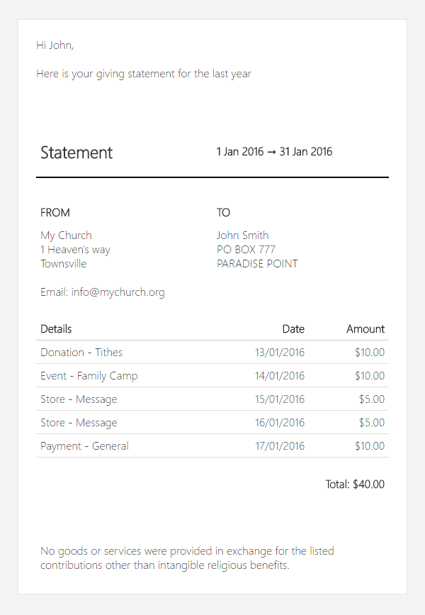

## It's about the heart

What’s one of the key measures to know if people call your church home? Their regular giving. Yet people don’t carry cash or use checks like they used to, these days providing secure and easy giving options is a must.

## Secure and easy giving

The payment options include online, SMS, mobile or in-person. One-off or recurring options to help increase the consistency of people’s giving. Staff can import or process giving and other payments and securely record the amount against the correct person so you have a record of how often they give. Come tax return time you can quickly send a statement to people with just a few clicks.

## Still more giving & finance options

*   **Unlimited** payments.
*   **Unlimited** people, only pay for regular attendees.
*   **Touch ID or pin-code security** so sensitive info isn’t easily accessed by others on your phone.
*   **Multi-site**.
*   Record pledges, donations and other payments.
*   **Flexible payment data import & export**.
*   **Use tags to categorize payment**.
*   **Send tax statements** to the entire church with just three clicks.
*   Export payments to your favorite accounting software, **i.e. Quickbooks, Xero, etc**.
*   **Receipts emailed with every payment** unless you choose not to.
*   Easily **resend receipts** to donors & customers.
*   **Issue refund,** both cash & Card.
*   Payments via **card, cash, ACH, check or PayPal**.
*   **PCI DSS compliant** gives peace of mind that all payment info is secure.
*   **Over 100 currencies** accepted by our payment processors.
*   **Flat monthly card processing** fees & **10 second giving** with [PushPay](https://ucarehq.com/blog/grow-your-church-donations-with-pushpay/).
*   Or card transaction **rates start at 1.75% + 30c per transaction** with Stripe.
*   **No per transaction fees** from UCare.
*   **Send personalized bulk SMS and email directly from UCare** to donors and customers.
*   Effortlessly **embed payment forms on your website or in an app**.
*   Publish a payment form to the UCare portal.
*   Customize embedded payment forms to **match your website or app style**.
*   Use on any tablet for **kiosk giving**.
*   Staff and volunteers can even **process payments over the phone**.
*   All UCare activity is **fully audited for data privacy** reporting needs.
*   **Optimized for low bandwidth** internet, no offline mode.
*   **Encrypted internet connection** to protect all data.
*   Supported on Google Chrome, Safari, Firefox, Edge and Internet Explorer 11+.
*   The mobile app is supported on iOS 8+, Android 4.4+ or Windows Phone 8+.

### Get started quickly

Select a payment service, add payment forms to your website and your ready to go. The set up options will grow as you need and we’re there to guide you with every step.

### People that care

We know it is frustrating when thing don’t work as expected, that's why we invest in a great support team to help with questions you have. We also have plenty of articles, videos and training available.

### Continual improvement

We’re always refining and improving based on our customer’s usage and needs. We want to work together to make UCare even better, when you have an idea or feedback feel free to share.