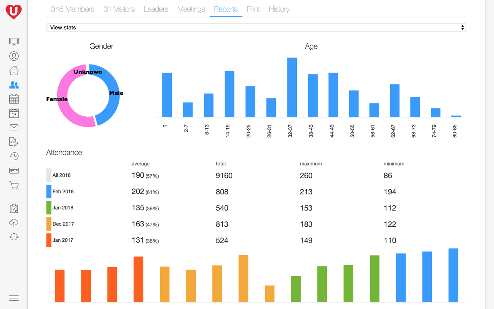
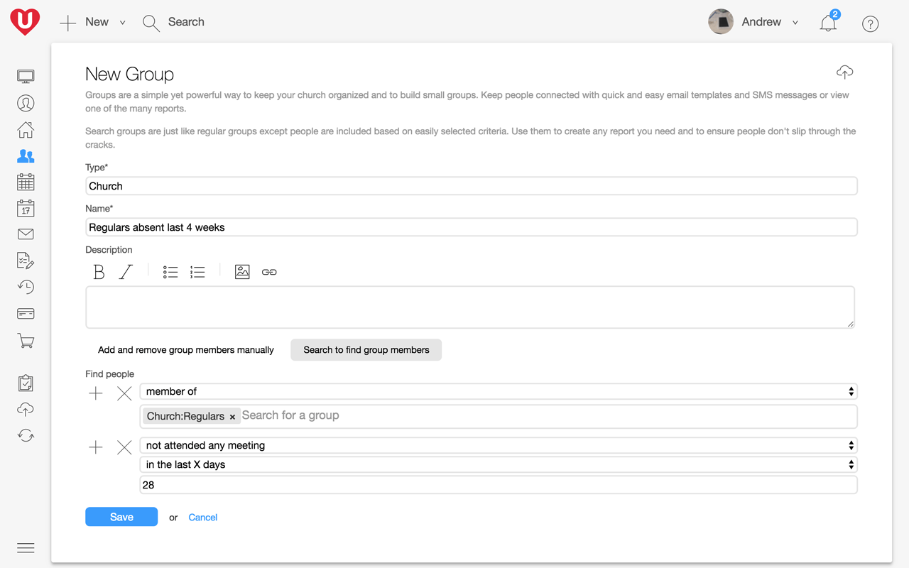

## Stay organized & help build connections

Your church has a lot going on that your team needs to manage. Groups are for organizing any list of people, be it a list of people with certain gifting’s, recent visitors, small groups, classes, ministries, campuses, the entire church and more.

## Make it a perfect fit

Instead of having to set up your ministries in a fixed structure, Groups are flexible to let you model your church structure. Either compile lists of people into groups or quickly select multiple criteria to create search groups. You can then send personalized bulk email & SMS to an entire group, perform bulk updates to group members, manage group leaders or view one of the reports.

## Simple yet powerful

Search group auto-update based on the criteria you select, in doing so they let you build almost any people report that your church may need. As examples you can create a list of recent visitors, birthdays, age specific groups, absent people, all your regular women, all the people at a particular campus, etc. If you're ever unsure how to create the search you need then our team is ready and waiting to help.

## Track all attendance

You can also [track attendance](/features/attendance-tracking/) of any of your groups. Small group leaders receive reminders that allow them to complete attendance reports on the spot with a few taps. The kids or youth team can use check-in to quickly & securely know who they have in their care and where they are located. Your hosting teams can also track attendance of individuals, headcounts, giving and other stats using the mobile app.

## Still more group options

*   **Unlimited** groups, times & group types.
*   **Unlimited** people & households, only pay for regular attendees.
*   **Unlimited** groups leaders, with custom roles.
*   **Touch ID or pin-code security** so sensitive info isn’t easily accessed by others on your phone.
*   **Organize groups by type**, for example by ministry type, small group, location.
*   Individually manage group members or use search groups to find people to include.
*   **Multi-site**.
*   **Secure attendance reports** are emailed to leaders in a way that **avoids the need for passwords**.
*   Record that a group didn’t meet, or **select who attended with just a few taps**.
*   **Add new people** as part of attendance reports or directly to the group.
*   **Track custom stats**, like giving, head count, decisions, it’s up to you really.
*   Visitors are promoted to members after attending 3 times in 60 days.
*   **Add photos in a snap** with a phone or tablet’s camera.
*   View a **variety of reports**, absent, attendance, new people, not in a group, birthdays, notes, medical, etc.
*   View a **stats report** of gender, age, attendance, members, giving, and other custom stats.
*   View an **overview report** for multiple group types.
*   View all group history.
*   **Protect groups** by group type or lock down individual groups.
*   Bulk **update profiles**.
*   **Custom search groups and reports **– group members update on-the-fly.
*   **Download reports** in CSV or PDF format.
*   **Flexible data import & export**; including unlimited custom fields.
*   **Send personalized bulk SMS and email directly from UCare** to attendees.
*   **Publish groups** to allow people to join or keep them private.
*   Published groups can be **quickly searched** to find a group.
*   Publish **groups to your portal**.
*   Or easily embed the **group directory on your website** so people can find and ask to join a group.
*   Add a **custom group sign-up message** – great for terms & conditions
*   **Group enquiry notifications** sent directly to the group leaders.
*   **Print nametags, directories** or address labels.
*   **Create tasks** for others or reminders for yourself.
*   All UCare activity is **fully audited for data privacy** reporting needs.
*   **Optimized for low bandwidth** internet, no offline mode.
*   **Encrypted internet connection** to protect all data.
*   Supported on Google Chrome, Safari, Firefox, Edge and Internet Explorer 11+.
*   The mobile app is supported on iOS 8+, Android 4.4+ or Windows Phone 8+.

### Get started quickly

Import your people, create groups, add members & leaders. The set up options will grow as you need and we’re there to guide you with every step.

### People that care

We know it is frustrating when thing don’t work as expected, that's why we invest in a great support team to help with questions you have. We also have plenty of articles, videos and training available.

### Continual improvement

We’re always refining and improving based on our customer’s usage and needs. We want to work together to make UCare even better, when you have an idea or feedback feel free to share.