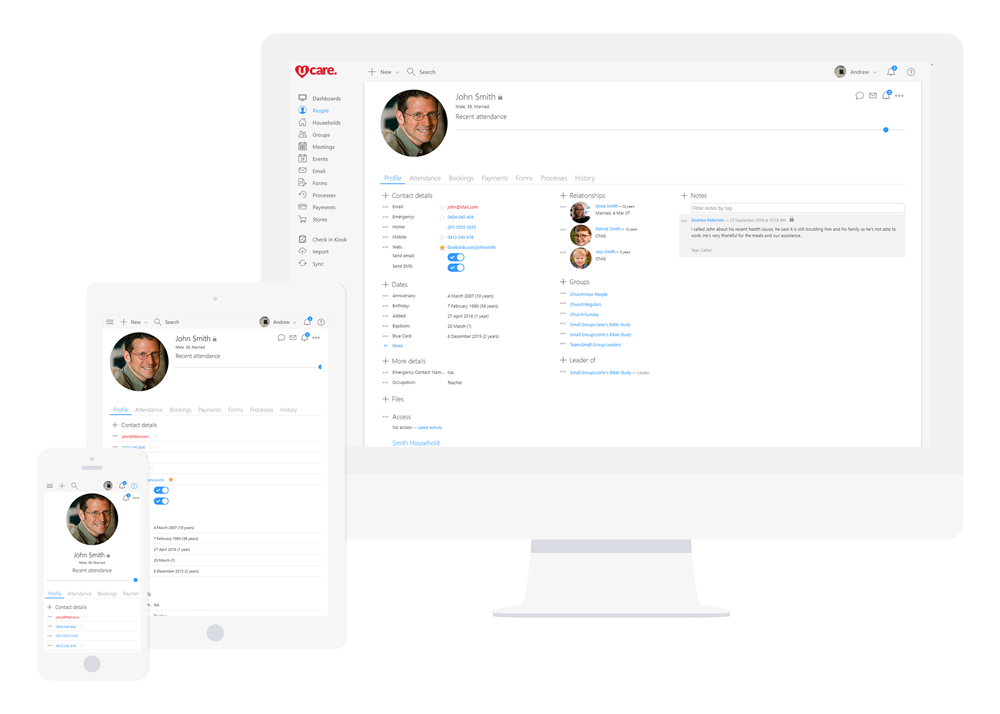

## People first

Desktop, laptop, tablet, mobile or other, today’s devices allow us to work in all manner of places. By having access to people’s profiles from wherever makes means you can get on with your job while ensuring the team all have access to the same up-to-date info.

## All your people stored safely in one place

Whether you have just a few people or thousands, you can see everything that’s going on at once. Quickly find or add people’s contact info, address, important dates, relationships and groups. Send bulk personalized email and SMS messages, add secure notes or assign a team member to follow them up all potentially on the go. And just like the real world you can group people by household which helps you gain a better understanding of each family unit. Be they a household of singles, newlyweds or mom; dad and three kids?

## More people options

*   **Unlimited** people, only pay for regular attendees.
*   Unlimited notes, relationships, custom dates & fields, contact info & groups.
*   **Touch ID or pin-code security** so sensitive info isn’t easily accessed by others on your phone.
*   **Multi-site**.
*   **Limit access to sensitive info**, including notes, contact info, custom dates & fields.
*   **Give people access** to exactly what you want.
*   Flag the **preferred contact method**.
*   **Unsubscribe from email or SMS**.
*   View **attendance, payment and event history**.
*   Easily **change photo’s using the camera** on any tablet or phone.
*   Merge duplicate profiles or use the bulk **duplicate finder**.
*   **Split & merge households** with ease.
*   People can **update their details** from a link included in every UCare email.
*   Or send a bulk **please update your details** email to people.
*   **Send personalized email or SMS** to one or multiple people.
*   **Print directories or export** just the info you need using [Groups](/features/groups/).
*   Switch the people page to **face view so you can better see every person**.
*   **Assign tasks that anyone can complete** from their email inbox, no password required.
*   All UCare activity is **fully audited for data privacy** reporting needs.
*   **Optimized for low bandwidth** internet, no offline mode.
*   **Encrypted internet connection** to protect all data.
*   Supported on Google Chrome, Safari, Firefox, Edge and Internet Explorer 11+.
*   The mobile app is supported on iOS 8+, Android 4.4+ or Windows Phone 8+.

### Get started quickly

Import your people; including children, create a meeting schedule and start checking in. The set up options will grow as you need and we’re there to guide you with every step.

### People that care

We know it is frustrating when thing don’t work as expected, that's why we invest in a great support team to help with questions you have. We also have plenty of articles, videos and training available.

### Continual improvement

We’re always refining and improving based on our customer’s usage and needs. We want to work together to make UCare even better, when you have an idea or feedback feel free to share.